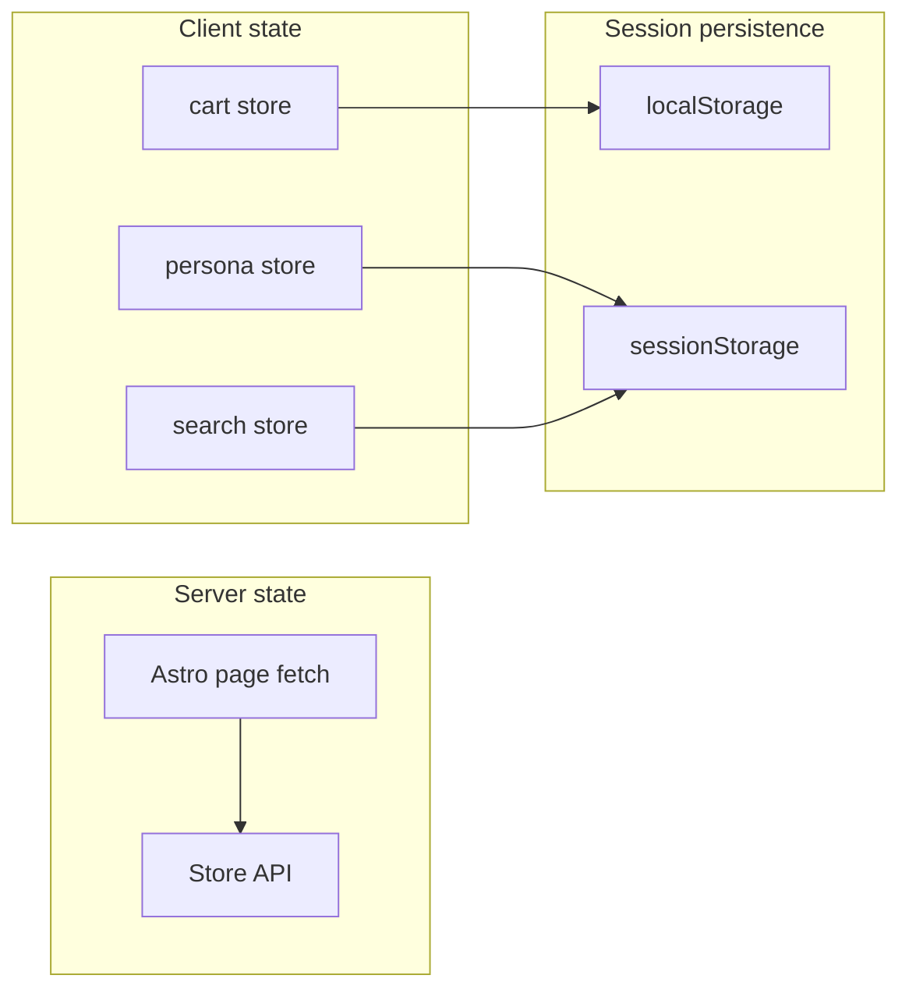

# B2CCoop — Design System & Frontend Architecture

> **Approved UX:** [UX-ARCHITECTURE.md](./UX-ARCHITECTURE.md) — navigation, personas, journeys, and IA are **final**. Do not change them here.  
> **Screens & sprints:** [UI-BLUEPRINT.md](./UI-BLUEPRINT.md) — screen inventory and 6-sprint roadmap.  
> **Scope:** Implementation architecture for `apps/web` (Astro + Cloudflare Pages). No application code in this document.

---

## Document map

| # | Section |
|---|---------|
| 1 | [Design System](#1-design-system) |
| 2 | [Component Library](#2-component-library) |
| 3 | [Astro Frontend Architecture](#3-astro-frontend-architecture) |
| 4 | [State Management Strategy](#4-state-management-strategy) |
| 5 | [Search UX Architecture](#5-search-ux-architecture) |
| 6 | [Accessibility Standards](#6-accessibility-standards) |
| 7 | [Frontend Performance Strategy](#7-frontend-performance-strategy) |
| 8 | [Design Tokens (Tailwind)](#8-design-tokens-tailwind) |
| 9 | [Component & Screen Inventory Summary](#9-component--screen-inventory-summary) |
| 10 | [Implementation Roadmap](#10-implementation-roadmap) |

---

# 1. Design System

### Design principles (implementation)

| Principle | Implementation rule |
|-----------|---------------------|
| Mobile first | Default styles at `sm` base; enhance at `md`+ |
| Low literacy | Min 16px body; icons always paired with text on primary actions |
| One coop brand | Single token file; no per-persona color themes except officer accent bar |
| Trust visible | `TrustBadge` required on every `OfferingCard` and detail hero |

---

## 1.1 Color system

### Semantic palette

| Token | Hex | Role |
|-------|-----|------|
| `brand-600` | `#0e7490` | Primary actions, links, focus rings |
| `brand-700` | `#0c6378` | Primary hover / pressed |
| `brand-50` | `#f0fdfa` | Brand tinted surfaces |
| `accent-600` | `#b45309` | Staff / officer CTAs, warnings |
| `accent-50` | `#fffbeb` | Officer banner background |
| `coop-600` | `#047857` | Coop trust, patronage, success coop |
| `coop-50` | `#ecfdf5` | Coop badge background |
| `member-600` | `#0369a1` | Member pricing, member seller |
| `member-50` | `#f0f9ff` | Member strip background |
| `neutral-0` | `#ffffff` | Cards, inputs |
| `neutral-50` | `#f8fafc` | Page background |
| `neutral-200` | `#e2e8f0` | Borders, dividers |
| `neutral-500` | `#64748b` | Secondary text, captions |
| `neutral-900` | `#0f172a` | Primary text |
| `danger-600` | `#b91c1c` | Errors, destructive |
| `danger-50` | `#fef2f2` | Error panels |
| `success-600` | `#15803d` | Complete status |
| `warning-600` | `#ca8a04` | Pending / attention |

### Persona accent (not a full theme)

| Persona mode | Surface only |
|--------------|--------------|
| Officer / Admin | `accent-50` top banner + `accent-600` border-bottom 2px |
| Default | No banner |

Do not change primary brand color per persona.

### Color usage rules

- **Primary button:** `brand-600` on white text.
- **Secondary button:** white bg, `neutral-200` border, `neutral-900` text.
- **Never** use red/green alone for status — always icon + label (`StatusIndicator`).
- **Contrast:** body text on `neutral-50` uses `neutral-900` (≥ 12:1). `neutral-500` only for captions ≥ 14px.

---

## 1.2 Typography scale

**Font stack:** `system-ui, -apple-system, "Segoe UI", Roboto, sans-serif` — no webfont load in MVP.

| Token | Size | Weight | Line height | Use |
|-------|------|--------|-------------|-----|
| `text-display` | 1.75rem (28px) | 700 | 1.2 | Hero headline (mobile) |
| `text-display-lg` | 2.25rem (36px) | 700 | 1.15 | Hero desktop |
| `text-title` | 1.25rem (20px) | 600 | 1.3 | Page titles |
| `text-title-sm` | 1.125rem (18px) | 600 | 1.35 | Section headers |
| `text-body` | 1rem (16px) | 400 | 1.5 | Body (minimum mobile) |
| `text-body-sm` | 0.875rem (14px) | 400 | 1.45 | Meta, hints |
| `text-caption` | 0.75rem (12px) | 500 | 1.4 | Badges, legal only — never sole body |
| `text-price` | 1.25rem | 700 | 1.2 | Offering price |
| `text-price-sm` | 1rem | 600 | 1.2 | Line totals |

**Rules:** Max line length 65ch on prose blocks. Truncate offering titles at 2 lines on cards (`line-clamp-2`).

---

## 1.3 Spacing scale

4px base grid.

| Token | Value | Use |
|-------|-------|-----|
| `space-0` | 0 | — |
| `space-1` | 0.25rem (4px) | Tight inline |
| `space-2` | 0.5rem (8px) | Badge padding |
| `space-3` | 0.75rem (12px) | Chip gaps |
| `space-4` | 1rem (16px) | Card padding mobile |
| `space-5` | 1.25rem (20px) | Section gaps |
| `space-6` | 1.5rem (24px) | Page horizontal padding desktop |
| `space-8` | 2rem (32px) | Section vertical rhythm |
| `space-10` | 2.5rem (40px) | Hero padding |
| `space-touch` | 2.75rem (44px) | Min button / tap height |
| `space-nav` | 4rem (64px) | Bottom nav clearance on main |

**Page gutters:** `space-4` mobile, `space-6` ≥ `md`.

---

## 1.4 Elevation system

Border-first aesthetic (low-literacy clarity); shadows minimal.

| Level | Token | Treatment |
|-------|-------|-----------|
| 0 | `elevation-0` | Flat on `neutral-50` |
| 1 | `elevation-1` | `1px solid neutral-200`, `radius-lg` — cards |
| 2 | `elevation-2` | `shadow-sm` + border — sticky bars, dropdowns |
| 3 | `elevation-3` | `shadow-md` — modals, search overlay |
| 4 | `elevation-4` | `shadow-lg` — bottom sheets mobile |

**Sticky elements:** `AddToCartBar`, `MobileBottomNav`, `StickyCheckoutBar` use `elevation-2` + `backdrop-blur` optional on supported browsers.

---

## 1.5 Icon system

| Rule | Spec |
|------|------|
| Library | **Lucide** (tree-shakeable SVG) — consistent 24px stroke |
| Sizes | `icon-sm` 16px, `icon-md` 20px, `icon-lg` 24px |
| Touch icons | 24px glyph inside 44px hit area |
| Category icons | Fixed map: Products=basket, Services=wrench, Tours=plane, etc. |
| Trust icons | See [UI-BLUEPRINT.md](./UI-BLUEPRINT.md) Part 5 |
| Decorative | `aria-hidden="true"` |
| Functional | `aria-label` on icon-only buttons |

**No emoji** as primary UI icons (cultural / literacy variance).

---

## 1.6 Responsive breakpoints

Align with Tailwind defaults.

| Token | Min width | Layout behavior |
|-------|-----------|-----------------|
| `xs` | 0 | Default — single column, bottom nav |
| `sm` | 640px | Slightly wider gutters |
| `md` | 768px | 2-col offering grid; header shows inline search |
| `lg` | 1024px | Shop mega-menu; 3-col grid; side nav on merchant dashboard |
| `xl` | 1280px | Max content width `1280px` centered |
| `2xl` | 1536px | CMS preview dual-pane |

**Container:** `max-w-7xl mx-auto px-4 md:px-6`.

**Bottom nav:** visible `< md` for customer personas; merchant may use `Sell` sub-nav same breakpoint.

---

# 2. Component Library

Convention: **Astro** for static shell; **React or Vue islands** only where client interactivity required (cart, search, persona, checkout). Prefix: `B2C` optional namespace in `components/`.

---

## 2.1 Atoms

### Buttons

| Variant | Use | Visual |
|---------|-----|--------|
| `primary` | Main CTA | `brand-600` fill |
| `secondary` | Alternate | white + border |
| `ghost` | Tertiary / nav | transparent |
| `danger` | Destructive confirm | `danger-600` |
| `staff` | Officer actions | `accent-600` |

| Size | Height | Padding |
|------|--------|---------|
| `sm` | 36px | px-3 |
| `md` | 44px | px-4 |
| `lg` | 48px | px-6 full-width mobile |

**States:** default, hover, active, focus-visible (ring 2px brand), disabled (opacity 50%), loading (spinner replaces label, `aria-busy`).

**Props contract:** `variant`, `size`, `loading`, `disabled`, `fullWidth`, `type`, `onClick`, `children`, `ariaLabel?` (required if icon-only).

---

### Inputs

| Type | Component |
|------|-----------|
| Text, email, tel | `Input` |
| Password | `Input` + show/hide toggle |
| Select | `Select` (native `<select>` MVP for a11y) |
| Textarea | `Textarea` |

**States:** default, focus, error (`danger-600` border + message), disabled.  
**Props:** `label` (required), `hint?`, `error?`, `name`, `value`, `onChange`, `autoComplete`, `inputMode?`.

---

### Badges

| Family | Examples |
|--------|----------|
| Trust | `coop-official`, `member-seller`, … |
| Status | `pending-pickup`, `complete`, `failed` |
| Promo | `member-price`, `-10%` |

**Props:** `variant`, `size` (sm/md), `icon?`, `children`. Max 24 chars label.

---

### Chips

| Type | Behavior |
|------|----------|
| Filter | toggle `aria-pressed` |
| Category | link to `/c/{slug}` |
| Removable | filter with × |

**Props:** `label`, `active`, `onRemove?`, `href?`.

---

### Avatars

| Variant | Use |
|---------|-----|
| User | account menu |
| Seller | merchant card |
| Placeholder | initials on `neutral-200` |

**Sizes:** sm 32px, md 40px, lg 56px. **Props:** `src?`, `alt`, `fallbackInitials`.

---

### Status indicators

Plain-language dot + label (not color alone).

| Status | Color dot | Label example |
|--------|-----------|---------------|
| pending | `warning-600` | Pay at pickup |
| active | `brand-600` | In progress |
| complete | `success-600` | Complete |
| failed | `danger-600` | Needs attention |

**Props:** `status` (enum maps to copy table in UI-BLUEPRINT).

---

## 2.2 Molecules

### Search bar

**Composition:** `Input` + search icon + clear button.  
**Variants:** `header` (compact), `overlay` (full width).  
**Props:** `value`, `placeholder`, `onSubmit`, `onChange`, `autoFocus?`.  
**Island:** yes (client).

---

### Merchant card

**Composition:** `Avatar` + seller name + `TrustBadge` row + listing count.  
**Use:** storefront header, offering detail seller block.  
**Props:** `seller` (`id`, `name`, `slug`, `badges`, `listingCount`).

---

### Offering card

**Composition:** media + `TrustBadge` + title + `Price` + `PatronageAmount` + `StatusIndicator`? + CTA.  
**Variants:** by `offeringType` + `bookingModel` (CTA: Add / Book / Quote).  
**Props:** `offering`, `onAction`, `layout` (grid | list).  
**States:** loading skeleton, unavailable, member-only overlay.  
**Shared:** all personas (merchant sees edit link overlay).

---

### Activity card

**Composition:** type icon + title + `Price` + `StatusIndicator` + chevron.  
**Use:** My Activity, merchant fulfillment queue.  
**Props:** `transaction` (`id`, `kind`, `title`, `amount`, `status`, `date`).

---

### Message preview

**Composition:** avatar + sender + snippet + time + unread dot.  
**Props:** `thread` — P2.  
**States:** unread (bold title).

---

### Notification item

**Composition:** icon by category + title + body + relative time + action link.  
**Props:** `notification`, `onRead`, `onAction`.  
**States:** read (muted), unread (bold).

---

## 2.3 Organisms

### App shell

**Composition:** `GlobalHeader` + `OfficerModeBanner?` + `<main>` + `TrustFooter` + `MobileBottomNav`.  
**Props:** `persona`, `cartCount`, `unreadNotifications`, `unreadMessages`.  
**Layout:** Astro wrapper; islands for header interactive parts.

---

### Bottom navigation

5 tabs per UX-ARCHITECTURE: Home, Search, Cart, Messages, You.  
**Props:** `activeTab`, badges.  
**Behavior:** `Cart` hidden badge when 0; route highlighting.  
**Island:** yes (active state + badges).

---

### Persona switcher

**Composition:** `PersonaOption` × N + current label.  
**Placement:** Account menu + You tab.  
**Props:** `personas[]`, `current`, `onChange`.  
**Island:** yes (writes session state).

---

### Activity feed

**Composition:** `ActivityTabs` + list of `ActivityCard` + `EmptyState`.  
**Props:** `transactions[]`, `tab`, `loading`, `onTabChange`.  
**Data:** server fetch + client pagination P1.

---

### Merchant dashboard

**Composition:** greeting + `KpiCard` row + `ActionQueue` + quick links.  
**Props:** `overview`, `queueItems`.  
**Layout:** single column mobile; 2-col KPI at `md`.

---

### Listing wizard

**Composition:** `WizardProgress` + step body (`DynamicMetadataForm` | type tiles) + sticky Next/Back.  
**Steps:** type → category → details → pricing → review.  
**Island:** full wizard client island (P2).

---

### CMS block renderer

**Composition:** maps `blockType` → block component (Hero, OfferingGrid, Banner, …).  
**Props:** `blocks[]` from `GET /content/pages/home`.  
**Fallback:** static blocks in Astro if API empty.

| Block type | Renders |
|------------|---------|
| `HERO` | `HeroBlock` |
| `OFFERING_GRID` | `OfferingCardGrid` |
| `BANNER` | `CampaignBanner` |
| `MEMBER_STRIP` | `MemberStrip` |
| `RICH_TEXT` | prose section |

---

# 3. Astro Frontend Architecture

**App root:** `apps/web/`  
**Adapter:** `@astrojs/cloudflare` (SSR on Pages).  
**Styling:** Tailwind CSS v4 (or v3) consuming tokens in §8.

---

## 3.1 Directory structure

```
apps/web/src/
├── components/          # Presentational UI (atoms → organisms)
│   ├── atoms/
│   ├── molecules/
│   ├── organisms/
│   └── islands/         # Client wrappers (.tsx or .vue) for hydration
├── features/            # Domain-specific UI + logic bundles
│   ├── discover/        # home, category, search
│   ├── offering/        # detail, offering card data adapters
│   ├── commerce/        # cart, checkout, receipt
│   ├── activity/        # my activity, transaction stepper
│   ├── coop/            # my coop, patronage
│   ├── sell/            # merchant dashboard, wizard, listings
│   ├── account/         # profile, persona switcher
│   ├── admin/           # pickup queue, approvals, cms
│   └── content/         # cms block renderer
├── layouts/
│   ├── AppLayout.astro      # App shell wrapper
│   ├── CheckoutLayout.astro # minimal chrome
│   └── AdminLayout.astro    # officer banner default on
├── pages/               # File-based routes (UX-ARCHITECTURE URLs)
│   ├── index.astro              # /
│   ├── search.astro             # /search
│   ├── c/[slug].astro           # /c/{category}
│   ├── o/[id].astro             # /o/{id}
│   ├── s/[slug].astro           # /s/{seller} (P1)
│   ├── cart.astro
│   ├── checkout.astro
│   ├── activity/
│   │   ├── index.astro
│   │   └── [id].astro
│   ├── coop.astro
│   ├── sell/
│   │   ├── index.astro
│   │   ├── listings.astro
│   │   ├── activity.astro
│   │   └── new/[step].astro
│   ├── account.astro
│   ├── messages/
│   ├── notifications.astro
│   └── admin/
├── stores/              # Client state modules (nanostores)
│   ├── cart.ts
│   ├── persona.ts
│   ├── search.ts
│   └── session.ts
├── lib/                 # Pure utilities, no UI
│   ├── api.ts           # fetch wrapper, PUBLIC_API_URL
│   ├── format.ts        # PHP money, dates
│   ├── offering.ts      # CTA label by booking model
│   ├── trust.ts         # badge priority sort
│   └── constants.ts     # routes, storage keys
├── services/            # API boundary functions
│   ├── catalog.ts
│   ├── checkout.ts
│   ├── orders.ts
│   ├── member.ts        # WebApp patronage proxy
│   └── content.ts       # CMS pages
└── styles/
    ├── tokens.css       # CSS variables from §8
    └── global.css       # tailwind imports, base resets
```

---

## 3.2 Layer rules

| Layer | Responsibility | May import |
|-------|----------------|------------|
| `pages/` | Route entry, data fetch, SEO | layouts, features, components |
| `features/` | Domain composition | components, services, stores |
| `components/` | Dumb UI | lib only |
| `services/` | HTTP / API | lib |
| `stores/` | Client reactive state | lib |
| `lib/` | Pure functions | nothing upstream |

**No** API calls inside atom components.  
**No** persona logic in offering card — pass props from page/feature.

---

## 3.3 Route ↔ feature mapping

| Route | Page | Feature module |
|-------|------|----------------|
| `/` | `index.astro` | `discover` |
| `/search` | `search.astro` | `discover` |
| `/c/[slug]` | `c/[slug].astro` | `discover` |
| `/o/[id]` | `o/[id].astro` | `offering` |
| `/cart` | `cart.astro` | `commerce` |
| `/checkout` | `checkout.astro` | `commerce` |
| `/order/[id]` | legacy → redirect `/activity/[id]` | `commerce` |
| `/activity` | `activity/index.astro` | `activity` |
| `/coop` | `coop.astro` | `coop` |
| `/sell` | `sell/index.astro` | `sell` |
| `/account` | `account.astro` | `account` |
| `/admin` | `admin/index.astro` | `admin` |

---

## 3.4 Island strategy (which framework)

| Island | Reason | Hydration |
|--------|--------|-----------|
| `CartStore` | qty, localStorage | `client:load` |
| `SearchOverlay` | focus, debounce | `client:idle` |
| `PersonaSwitcher` | sessionStorage | `client:load` |
| `CheckoutForm` | validation, firebase | `client:visible` |
| `StaffConfirmPanel` | admin secret | `client:visible` |
| `MobileBottomNav` | active tab | `client:load` |

Prefer **React** for islands if sharing types with future RN; **Vue** acceptable if team preference — pick one in Sprint 1.

Default: **static Astro** for Home grid (SSR catalog HTML).

---

# 4. State Management Strategy

### Overview



---

## 4.1 Server state

| Data | Owner | Pattern |
|------|-------|---------|
| Catalog, offering detail | Astro `fetch` in frontmatter | SSR per request; `Cache-Control` on API |
| Order receipt | Astro fetch by id | No client cache MVP |
| Home CMS blocks | Astro fetch | CDN cache 5m |
| Member patronage | Server fetch via BFF or client island | Short TTL 60s |

**Library:** None required — Astro native fetch. Optional **TanStack Query** in islands only if client refetch heavy (P2).

**Invalidation:** Receipt page polls or manual refresh after staff confirm — no WebSocket MVP.

---

## 4.2 Client state

| Concern | Store | Scope |
|---------|-------|-------|
| Cart lines | `stores/cart.ts` | global island |
| Checkout form draft | component state | checkout island only |
| Wizard draft | `sessionStorage` | sell wizard P2 |
| UI toasts | ephemeral module | global |

**Library:** **Nanostores** (lightweight, framework-agnostic) — recommended.

---

## 4.3 Session state

| Key | Storage | Content |
|-----|---------|---------|
| `b2ccoop_persona` | sessionStorage | `customer` \| `member` \| `merchant` \| `officer` \| `admin` |
| `b2ccoop_officer_ack` | sessionStorage | officer banner dismissed |
| Firebase auth | Firebase SDK persistence | IndexedDB / local |

Persona does **not** change auth token — only nav + visible routes.

---

## 4.4 Persona state

| Source | Derives |
|--------|---------|
| Firebase user | logged in |
| `GET /account/personas` (P1) | enabled personas |
| MVP heuristic | member if Firebase + resolve API returns participantId |
| Staff secret panel | officer mode local until staff JWT P1 |

**Default on login:** `member` if participantId else `customer`.  
**Switch:** updates `sessionStorage` + dispatches `persona-change` event for islands.

---

## 4.5 Cart state

| Field | Type |
|-------|------|
| `lines[]` | `{ sku, name, quantity, unitPrice, vendorCode }` |
| `updatedAt` | ISO string |

**Persistence:** `localStorage` key `b2ccoop_cart_v1`.  
**Sync:** single-vendor rule — clear cart if new vendor added (existing behavior).  
**Server cart:** P2 for logged-in users.

---

## 4.6 Search state

| Field | Storage |
|-------|---------|
| `query` | URL `?q=` (shareable) |
| `recent[]` | localStorage max 8 |
| `saved[]` | localStorage (P2) |
| `location` | sessionStorage barangay id (P1) |

Debounce 300ms in search island. MVP: client-filter catalog snapshot; P1: server `GET /search`.

---

# 5. Search UX Architecture

Per UX-ARCHITECTURE §5 — implementation mapping only.

### 5.1 Global search

| Layer | Responsibility |
|-------|----------------|
| `SearchOverlay` island | UI, debounce, keyboard |
| `services/search.ts` | API / client filter |
| `/search` page | SSR results for `?q=` (SEO optional noindex) |

**Entry:** header icon, bottom nav tab, `/` shortcut focus on desktop.

---

### 5.2 Search suggestions

| Type | Source |
|------|--------|
| Categories | static config `lib/search-suggestions.ts` |
| Popular | API `GET /search/popular` P2; MVP static |
| Offerings | API autocomplete P1 |

Dropdown max 8 items; keyboard ↑↓ + Enter.

---

### 5.3 Recent searches

- On submit: push to `recent[]` in localStorage (dedupe, case-insensitive).
- Show when input empty (overlay open).
- Clear all control.

---

### 5.4 Saved searches

P2 — long-press or star on result row. Stored localStorage until account sync P3.

---

### 5.5 Location-aware search

| Phase | Behavior |
|-------|----------|
| MVP | Optional barangay picker in filter sheet |
| P1 | `?lat=&lng=` or `barangay=` query param |
| P2 | “Near me” browser geolocation with consent |

**UI:** `FilterChip` “Near me” + location display chip.  
**API:** `GET /search?q=&barangay=` per PLATFORM-CORE-SERVICES geo engine.

---

### Search component flow

```
User types → debounce → suggestions (local)
           → submit → /search?q=
           → results OfferingCardGrid + EmptyStateSearch
```

---

# 6. Accessibility Standards

**Target:** WCAG **2.1 Level AA** for MVP paths (browse, checkout, receipt).

### Mobile-first

- 44×44px minimum touch targets (`space-touch`).
- Form inputs 16px+ to prevent iOS zoom.
- Bottom nav labels always visible (not icon-only).

### Color & contrast

- Text contrast ≥ 4.5:1 body, 3:1 large text.
- Status never color-only — `StatusIndicator` includes text.

### Keyboard

- Skip link “Skip to main content” first focusable.
- Search overlay: Esc closes, focus trap.
- Modals / drawers: focus trap + return focus on close.
- Visible `focus-visible` ring `brand-600` 2px.

### Screen readers

- Page `<title>` unique per route.
- `OfferingCard` CTA: “Add {name} to cart”.
- `TransactionStepper`: `aria-current="step"`.
- Live regions: toast `role="alert"`, cart count `aria-live="polite"`.
- Officer banner: `role="status"` on persona switch.

### Motion

- Respect `prefers-reduced-motion` — disable slide animations.

### Testing

- Manual: VoiceOver (iOS), TalkBack (Android).
- Automated: axe-core in CI on key pages (Sprint 3+).

---

# 7. Frontend Performance Strategy

### 7.1 Streaming & SSR

- Astro SSR streams HTML from Cloudflare Pages.
- Critical path: shell + hero + first 4 offering cards server-rendered.
- Below-fold grids: same SSR document (no lazy SSR split MVP).

### 7.2 Partial hydration

- **≤ 15%** of page weight interactive (islands only).
- Home: static HTML catalog grid; `OfferingCard` CTA buttons optional micro-island batch P1.
- Cart badge: single small island in header.

### 7.3 Island architecture

| Page | Islands count target |
|------|---------------------|
| Home | 2 (nav, member strip sign-in) |
| Offering detail | 2 (add to cart, gallery swipe optional) |
| Checkout | 1 (full form) |
| Cart | 1 |

### 7.4 Image optimization

- Astro `<Image>` or ``.
- Offering images: WebP via Cloudflare Images or build-time sharp (compile).
- Sizes: card 400w, detail 800w, hero 1200w `srcset`.
- Placeholder: `neutral-200` skeleton aspect-ratio 4:3.

### 7.5 Caching strategy

| Asset | Cache |
|-------|-------|
| Static JS/CSS | `immutable` 1y hashed |
| HTML (SSR) | `no-cache` or short CDN TTL 60s |
| `GET /catalog` API | Cloudflare cache 2m + stale-while-revalidate |
| localStorage cart | client only |

**Prefetch:** link `prefetch` on OfferingCard hover desktop only P2.

### Budgets (mobile 4G)

| Metric | Target |
|--------|--------|
| LCP | < 2.5s |
| INP | < 200ms |
| CLS | < 0.1 |
| JS per page | < 80kb gzip |

---

# 8. Design Tokens (Tailwind)

Export as `tailwind.config` theme extension — definitions below (implementation copies into config).

### 8.1 Colors

```yaml
colors:
  brand:
    50: "#f0fdfa"
    600: "#0e7490"
    700: "#0c6378"
  accent:
    50: "#fffbeb"
    600: "#b45309"
  coop:
    50: "#ecfdf5"
    600: "#047857"
  member:
    50: "#f0f9ff"
    600: "#0369a1"
  neutral:
    0: "#ffffff"
    50: "#f8fafc"
    200: "#e2e8f0"
    500: "#64748b"
    900: "#0f172a"
  danger:
    50: "#fef2f2"
    600: "#b91c1c"
  success:
    600: "#15803d"
  warning:
    600: "#ca8a04"
```

### 8.2 Typography

```yaml
fontFamily:
  sans: ["system-ui", "-apple-system", "Segoe UI", "Roboto", "sans-serif"]
fontSize:
  display: ["1.75rem", { lineHeight: "1.2", fontWeight: "700" }]
  display-lg: ["2.25rem", { lineHeight: "1.15", fontWeight: "700" }]
  title: ["1.25rem", { lineHeight: "1.3", fontWeight: "600" }]
  title-sm: ["1.125rem", { lineHeight: "1.35", fontWeight: "600" }]
  body: ["1rem", { lineHeight: "1.5", fontWeight: "400" }]
  body-sm: ["0.875rem", { lineHeight: "1.45", fontWeight: "400" }]
  caption: ["0.75rem", { lineHeight: "1.4", fontWeight: "500" }]
  price: ["1.25rem", { lineHeight: "1.2", fontWeight: "700" }]
```

### 8.3 Spacing

```yaml
spacing:
  touch: "2.75rem"
  nav: "4rem"
  # plus default Tailwind 4px scale
```

### 8.4 Border radius

```yaml
borderRadius:
  md: "0.5rem"
  lg: "0.75rem"
  xl: "1rem"
  full: "9999px"
```

### 8.5 Box shadow

```yaml
boxShadow:
  sm: "0 1px 2px 0 rgb(0 0 0 / 0.05)"
  md: "0 4px 6px -1px rgb(0 0 0 / 0.1)"
  lg: "0 10px 15px -3px rgb(0 0 0 / 0.1)"
```

### 8.6 Breakpoints

```yaml
screens:
  sm: "640px"
  md: "768px"
  lg: "1024px"
  xl: "1280px"
  2xl: "1536px"
```

### 8.7 CSS variables (parallel layer)

`styles/tokens.css` mirrors tokens for non-Tailwind contexts:

```css
:root {
  --color-brand: #0e7490;
  --color-surface: #f8fafc;
  --space-page: 1rem;
  --radius-card: 0.75rem;
  --height-touch: 2.75rem;
}
```

---

# 9. Component & Screen Inventory Summary

Full detail in [UI-BLUEPRINT.md](./UI-BLUEPRINT.md).

### Components to build (by sprint)

| Sprint | Components |
|--------|------------|
| 1 | Atoms, `AppShell`, `MobileBottomNav`, `GlobalHeader`, `EmptyState`, `TrustBadge` |
| 2 | `OfferingCard`, `SearchBar`, `CategoryChip`, `HeroBlock`, `MemberStrip`, `CampaignBanner` |
| 3 | `CartLineItem`, `CheckoutForm`, `TransactionStepper`, `StaffConfirmPanel`, `StickyCheckoutBar` |
| 4 | `PersonaSwitcher`, `ActionQueue`, `KpiCard`, `PickupQueue` |
| 5 | `ActivityCard`, `PatronageCard`, `MerchantCard`, `ActivityFeed` |
| 6 | `NotificationItem`, `CmsBlockRenderer`, `WizardProgress`, `ApprovalQueue` |

### Screens (P0 → P2)

| P0 | P1 | P2 |
|----|----|-----|
| Home, Search, Category, Detail, Cart, Checkout, Receipt, Admin pickup | Activity, Coop, Account, Sell dashboard, Sell activity, Storefront | Messages, Notifications, Wizard, Payouts, HQ approvals, CMS |

---

# 10. Implementation Roadmap

Aligned with [UI-BLUEPRINT.md](./UI-BLUEPRINT.md) §7 — expanded with frontend tasks.

### Sprint 1 — Foundation

| Task | Output |
|------|--------|
| Add Tailwind + tokens.css | Design system wired |
| Create `src/` folder structure | Architecture in repo |
| Implement atoms | Storybook optional |
| `AppLayout.astro` + bottom nav + header | Shell |
| Route stubs all P0 paths | Navigation works |
| `lib/api.ts`, `services/catalog.ts` | API layer |

**Exit:** Click through empty P0 routes on mobile.

---

### Sprint 2 — Marketplace browsing

| Task | Output |
|------|--------|
| `OfferingCard` + grid | Reusable |
| Migrate `/catalog` → `/` and `/c/products` | Home + category |
| `/o/[id]` offering detail | Detail |
| `SearchOverlay` + `/search` | Search MVP |
| Trust badges on all cards | Trust system |
| SSR catalog on Home | Performance baseline |

**Exit:** Browse → detail without JS failure blocking view.

---

### Sprint 3 — Transactions

| Task | Output |
|------|--------|
| `stores/cart.ts` + Cart page | Commerce |
| Checkout island + Turnstile hook | Checkout |
| Receipt + stepper + staff panel | Receipt |
| Admin pickup in `AdminLayout` | Officer P0 |
| axe pass on checkout path | A11y |

**Exit:** E2E order flow production-ready.

---

### Sprint 4 — Merchant & persona

| Task | Output |
|------|--------|
| `stores/persona.ts` + switcher island | Personas |
| `/account`, officer banner | Account |
| `/sell` dashboard + `/sell/activity` | Merchant |
| Refactor `/admin` into sell activity view | Unified officer UX |

**Exit:** Persona switch without reload; officer fulfills queue.

---

### Sprint 5 — Membership layer

| Task | Output |
|------|--------|
| `/coop` patronage island | My Coop |
| `/activity` list + email lookup | Activity |
| Member pricing on detail | Member UX |
| `/s/[slug]` storefront | Merchant discovery |

**Exit:** Member sees patronage; activity list works.

---

### Sprint 6 — Growth & admin

| Task | Output |
|------|--------|
| `CmsBlockRenderer` + admin editor shell | CMS |
| Notifications drawer empty → live P2 | Notifications |
| Listing wizard shell P2 | Merchant self-serve |
| Performance audit + image srcset | Perf |
| Shared package extraction `@b2ccoop/store-ui` if monorepo ready | Reuse |

---

### Cross-cutting checklist (every sprint)

- [ ] Mobile bottom nav on all `AppLayout` pages
- [ ] Touch targets ≥ 44px
- [ ] Focus states on interactive elements
- [ ] Plain-language status labels
- [ ] Empty states per UI-BLUEPRINT Part 4
- [ ] `PUBLIC_API_URL` env on build

---

## Related documents

- [UX-ARCHITECTURE.md](./UX-ARCHITECTURE.md)
- [UI-BLUEPRINT.md](./UI-BLUEPRINT.md)
- [MARKETPLACE-DOMAIN.md](./MARKETPLACE-DOMAIN.md)
- [DEPLOY-PHASE-2B.md](./DEPLOY-PHASE-2B.md)
