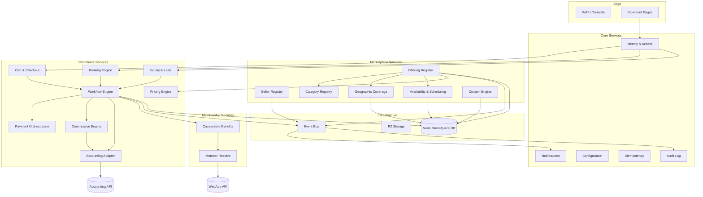
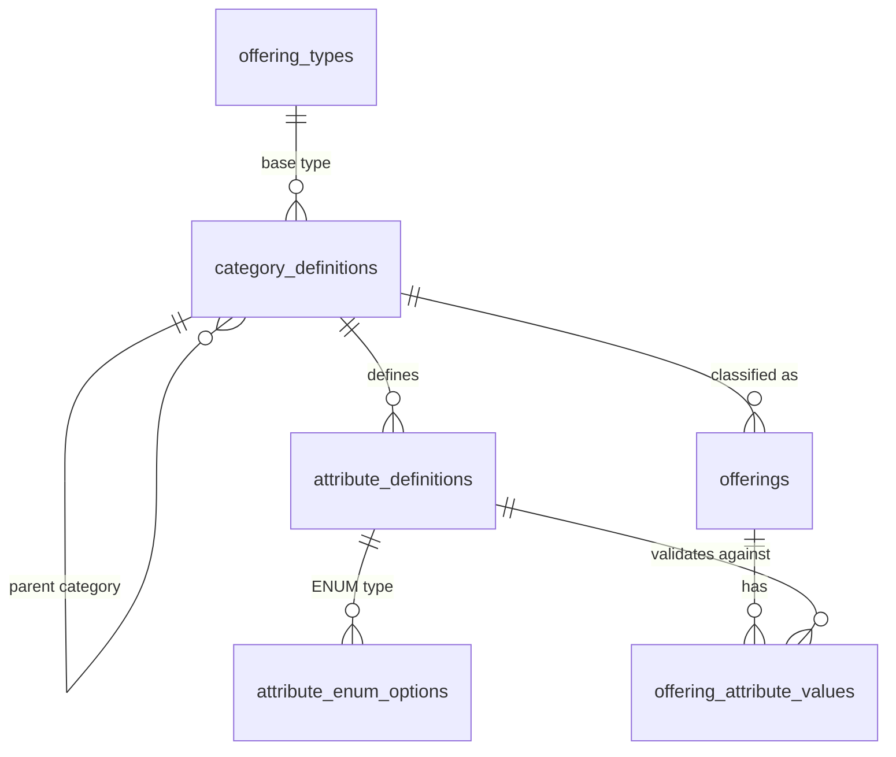
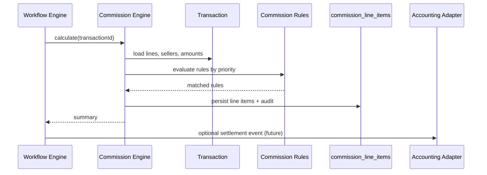
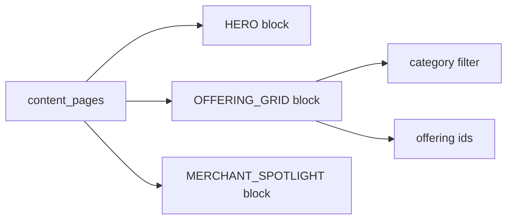
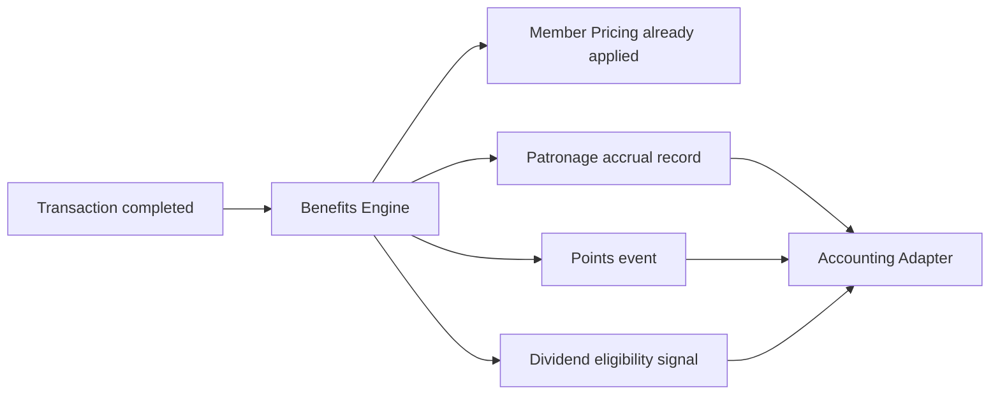
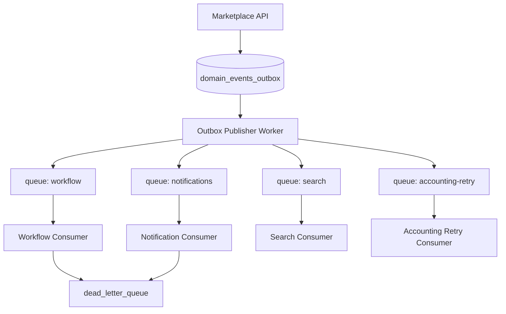

# B2CCoop Platform Core Services Design

> **Phase objective:** Design platform capabilities that support future marketplace categories **without major code changes**.  
> **Constraint:** Domain model, merchant model, offering model, transaction model, and modular monolith architecture are **already established** — see [MARKETPLACE-DOMAIN.md](./MARKETPLACE-DOMAIN.md). Do not redesign existing modules.  
> **Scope:** Platform services and extensibility only. No implementation code in this document.

---

## Document map

| Deliverable | Section |
|-------------|---------|
| 1. Platform Capability Map | [§1](#deliverable-1-platform-capability-map) |
| 2. Metadata Framework | [§2](#deliverable-2-metadata-framework) |
| 3. Workflow Engine | [§3](#deliverable-3-workflow-engine) |
| 4. Commission and Revenue Engine | [§4](#deliverable-4-commission-and-revenue-engine) |
| 5. Geographic Coverage Engine | [§5](#deliverable-5-geographic-coverage-engine) |
| 6. Availability and Scheduling Engine | [§6](#deliverable-6-availability-and-scheduling-engine) |
| 7. Marketplace Content Engine | [§7](#deliverable-7-marketplace-content-engine) |
| 8. Cooperative Benefits Engine | [§8](#deliverable-8-cooperative-benefits-engine) |
| 9. Event-Driven Architecture | [§9](#deliverable-9-event-driven-architecture) |
| 10. Platform API Standards | [§10](#deliverable-10-platform-api-standards) |

---

# Deliverable 1: Platform Capability Map

## 1. Problem Statement

Marketplace categories (products, services, tours, rentals, insurance, lending, tickets) share cross-cutting needs — identity, pricing rules, workflows, geography, scheduling, commissions, content, and cooperative benefits. Without a explicit capability map, each new category risks duplicating logic and forcing schema or API redesign.

## 2. Architecture Decision

Adopt a **modular monolith** inside the Marketplace API (B2C-Store Worker) with **platform services** as bounded modules. Domain modules (`offerings`, `transactions`, `sellers`) remain stable; category-specific behavior is composed from platform services via configuration (metadata, workflows, rules) rather than hard-coded branches.

Sibling systems retain their boundaries:

- **WebApp** — member identity and lifecycle
- **Accounting** — ledger posting and finance truth
- **Marketplace** — listings, commerce, platform services

## 3. Data Model

Capabilities are **logical modules**, not necessarily separate databases. Shared reference data (geo, categories, workflow defs) lives in Marketplace Postgres; financial truth stays in Accounting.

### Capability categories

#### Core Services

| Capability | Purpose |
|------------|---------|
| **Identity & Access** | Firebase token verify, service tokens, RBAC context |
| **Tenant / Org Context** | Coop scope, merchant scope, HQ scope |
| **Audit Log** | Immutable action trail |
| **Configuration Registry** | Feature flags, environment-scoped settings |
| **Idempotency Store** | Keys for payments, webhooks, event handlers |
| **Notification Dispatch** | Email, SMS, push (async) |

#### Marketplace Services

| Capability | Purpose |
|------------|---------|
| **Seller Registry** | Merchants, accreditation, seller kinds |
| **Offering Registry** | Listings hub, publish lifecycle |
| **Category Registry** | Metadata-driven categories (Deliverable 2) |
| **Catalog & Search** | Discovery, filters, facets |
| **Geographic Coverage** | Service areas, delivery zones (Deliverable 5) |
| **Availability & Scheduling** | Slots, capacity, assets (Deliverable 6) |
| **Content & CMS** | Pages, campaigns, blocks (Deliverable 7) |

#### Commerce Services

| Capability | Purpose |
|------------|---------|
| **Cart & Checkout** | ORDER-model flows |
| **Booking Engine** | BOOKING-model reservations |
| **Inquiry & Lead Engine** | INQUIRY / LEAD capture |
| **Pricing Engine** | Base price, member price, quotes |
| **Payment Orchestration** | PayMongo, pickup confirm, future gateways |
| **Commission Engine** | Rules and settlement splits (Deliverable 4) |
| **Accounting Adapter** | `marketplace-sale` and future journal events |
| **Workflow Engine** | State machines per transaction type (Deliverable 3) |

#### Membership Services

| Capability | Purpose |
|------------|---------|
| **Member Resolve** | Email → `Participant.id` via WebApp |
| **Cooperative Benefits** | Patronage, points, member pricing (Deliverable 8) |
| **Accrual Linking** | Guest email → member merge |

#### Administration Services

| Capability | Purpose |
|------------|---------|
| **HQ Admin** | Category defs, workflows, commissions, content |
| **Merchant Admin** | Offerings, availability, orders/bookings |
| **Moderation & Approval** | Seller/offering publish gates |
| **Reporting & Exports** | Operational dashboards (read models) |

#### Infrastructure Services

| Capability | Purpose |
|------------|---------|
| **Event Bus** | Cloudflare Queues + outbox (Deliverable 9) |
| **Object Storage** | R2 for images, documents |
| **Edge Security** | WAF, Turnstile, rate limits |
| **Hyperdrive / Neon** | Marketplace database |
| **Observability** | Logs, traces, DLQ monitoring |

### Dependency diagram



## 4. API Design

Platform services expose **internal module interfaces** within the Worker monolith. External HTTP surface is grouped by audience:

| Prefix | Audience |
|--------|----------|
| `/catalog`, `/offerings` | Public discovery |
| `/checkout`, `/bookings`, `/inquiries` | Public commerce |
| `/admin/hq/*` | HQ administrators |
| `/admin/merchant/*` | Merchant operators |
| `/integrations/v1/*` | Service-to-service (WebApp, Accounting callbacks) |
| `/webhooks/*` | PayMongo and future gateways |

Each capability module registers routes through a single Hono app with shared middleware (auth, audit, idempotency).

## 5. Extension Strategy

- New marketplace category → **Category Registry** entry + metadata schema + workflow definition + optional commission profile. No change to `offerings` hub shape.
- New payment method → **Payment Orchestration** plugin implementing a shared `PaymentProvider` interface.
- New journal event → **Accounting Adapter** handler; domain transactions unchanged.
- Heavy read paths (search, geo) → read models or materialized views fed by events.

## 6. Risks

| Risk | Mitigation |
|------|------------|
| Monolith becomes a “big ball of mud” | Enforce module boundaries; no cross-module DB access except via service interfaces |
| Duplication with WebApp/Accounting | Strict integration contracts; events for async side effects |
| Premature microservices split | Stay monolith until a capability needs independent scale (likely search or notifications) |

## 7. Future Scalability Considerations

- Extract **Event Bus consumers** (notifications, search index) to separate Workers when volume demands.
- **Geo queries** may move to PostGIS or a dedicated geo index service at high catalog scale.
- **CMS** may integrate headless CMS (Sanity/Decap) while keeping composition API in-platform.

---

# Deliverable 2: Metadata Framework

## 1. Problem Statement

Hard-coding attributes per category (electrician vs tour vs loan) requires schema migrations and deploys for every new vertical. HQ must define categories and attributes administratively.

## 2. Architecture Decision

**Metadata-driven category model** layered on the established `offering` hub:

- **Category definitions** are data, not DDL.
- **Attribute definitions** describe fields, validation, and UI widgets.
- **Offering attribute values** stored in typed JSONB with schema validation at write time.
- Optional **detail tables** remain for high-volume query paths (inventory, capacity) — populated from metadata or synced — but category *definition* never requires DDL.

Inheritance: categories extend a **parent offering type** (`SERVICE`, `TOUR`, etc.) and inherit base attribute sets.

## 3. Data Model

### Entity relationship



### Tables (conceptual)

| Table | Key fields |
|-------|------------|
| `offering_types` | `code` (PRODUCT, SERVICE, …), `default_booking_model`, `base_workflow_key` |
| `category_definitions` | `id`, `slug`, `name`, `offering_type_code`, `parent_category_id`, `is_active`, `version`, `metadata` |
| `attribute_definitions` | `id`, `category_id`, `key`, `label`, `data_type`, `required`, `validation_rules` (JSON), `ui_widget`, `sort_order`, `inherited_from_parent` |
| `attribute_enum_options` | `attribute_definition_id`, `value`, `label`, `sort_order` |
| `offering_attribute_values` | `offering_id`, `attribute_key`, `value_json`, `category_definition_version` |
| `category_form_layouts` | `category_id`, `sections` (JSON — field groups, order, conditional visibility) |

### Metadata schema (category definition document)

| Field | Type | Description |
|-------|------|-------------|
| `slug` | string | Stable key, e.g. `skilled-trades/electrician` |
| `offeringType` | enum | Inherited offering type |
| `bookingModel` | enum | Default ORDER / BOOKING / INQUIRY / LEAD |
| `workflowKey` | string | Reference to workflow_definitions |
| `commissionProfileKey` | string | Reference to commission profile |
| `geoRequired` | boolean | Whether coverage engine must validate |
| `schedulingRequired` | boolean | Whether availability engine attaches |

### Attribute schema (attribute definition)

| Field | Type | Description |
|-------|------|-------------|
| `key` | string | Machine name, e.g. `license_number` |
| `dataType` | enum | `STRING`, `NUMBER`, `BOOLEAN`, `DATE`, `ENUM`, `MONEY`, `DURATION`, `GEO_POINT`, `JSON` |
| `validationRules` | object | min, max, pattern, minLength, allowedUnits |
| `uiWidget` | enum | `text`, `select`, `multiselect`, `date`, `map`, `file`, `rich_text` |
| `searchable` | boolean | Index for catalog facets |
| `comparable` | boolean | Use in filters |

### Validation model

1. Load `category_definition` + merged attributes (child overrides parent).
2. Compile JSON Schema per category (cached in Worker KV).
3. Validate `offering_attribute_values` on create/update.
4. Reject unknown keys; coerce types; apply cross-field rules via `validation_rules.custom` expressions (safe DSL, not arbitrary code).

### Dynamic form model

HQ Admin UI reads `category_form_layouts` + `attribute_definitions` → renders forms. Storefront listing detail pages use the same schema with read-only widgets.

### Category inheritance

```
SERVICE (offering type)
  └── skilled-trades (category)
        └── electrician (category)
              + inherits: service_area, hourly_rate, license_number
              + adds: voltage_certification, emergency_callout
```

Child categories **merge** parent attribute definitions; child may `override` label/required or `hide` inherited fields.

### Configuration examples (metadata only)

**Electrician Service** (`SERVICE` / `BOOKING`)

| Attribute | Type | Widget | Validation |
|-----------|------|--------|------------|
| `service_area` | GEO | map | coverage engine link |
| `hourly_rate` | MONEY | text | min 0 |
| `license_number` | STRING | text | pattern, required |
| `emergency_callout` | BOOLEAN | toggle | — |
| `availability_profile_id` | STRING | select | FK to scheduling profile |

**Travel Package** (`TOUR` / `BOOKING`)

| Attribute | Type | Notes |
|-----------|------|-------|
| `duration_days` | NUMBER | min 1 |
| `departure_cities` | ENUM[] | multiselect |
| `max_pax` | NUMBER | ties to capacity engine |
| `itinerary` | JSON | rich_text / structured blocks |
| `inclusions` | STRING[] | — |

**Loan Product** (`FINANCIAL` / `INQUIRY`)

| Attribute | Type | Notes |
|-----------|------|-------|
| `min_amount` / `max_amount` | MONEY | — |
| `term_months` | NUMBER | — |
| `interest_type` | ENUM | fixed, diminishing |
| `eligibility_rules` | JSON | metadata DSL → benefits engine |
| `required_documents` | ENUM[] | file upload on application |

**Insurance Product** (`INSURANCE` / `LEAD`)

| Attribute | Type | Notes |
|-----------|------|-------|
| `coverage_type` | ENUM | life, health, property |
| `premium_from` | MONEY | display “from” price |
| `underwriting_partner` | STRING | external ref |
| `disclosure_pdf` | FILE | R2 URL |

**Equipment Rental** (`RENTAL` / `BOOKING`)

| Attribute | Type | Notes |
|-----------|------|-------|
| `asset_type` | ENUM | vehicle, tool, space |
| `deposit_amount` | MONEY | — |
| `min_rental_days` | NUMBER | — |
| `pickup_location` | GEO_POINT | geo engine |
| `asset_schedule_id` | STRING | scheduling engine |

## 4. API Design

| Method | Path | Purpose |
|--------|------|---------|
| GET | `/admin/hq/categories` | List category tree |
| POST | `/admin/hq/categories` | Create category (draft version) |
| PUT | `/admin/hq/categories/:id/publish` | Publish version (immutable snapshot) |
| GET | `/admin/hq/categories/:slug/schema` | JSON Schema + form layout |
| GET | `/catalog/categories/:slug/facets` | Searchable attributes for filters |
| PUT | `/admin/merchant/offerings/:id/attributes` | Validate and save attribute values |

## 5. Extension Strategy

- New vertical → HQ creates category under existing `offering_type`; no deploy.
- Performance-critical attribute → add optional **materialized column** or detail table synced on publish event (`offering.published`).
- Versioning: offerings pin `category_definition_version`; schema changes do not break published listings until merchant re-publishes.

## 6. Risks

| Risk | Mitigation |
|------|------------|
| JSONB query performance | Mark `searchable` attributes; index expression or sync to facet table on publish |
| Schema complexity for HQ users | Templates per offering type; import/export JSON |
| Validation DSL abuse | Sandboxed rule evaluator; no eval() |

## 7. Future Scalability Considerations

- Category schema cache in KV; invalidate on `category.published` event.
- Full-text + facet search engine (Typesense, Postgres FTS) fed by attribute sync consumer.

---

# Deliverable 3: Workflow Engine

## 1. Problem Statement

Product orders, tour bookings, loan applications, and insurance leads follow different state machines. Hard-coding each flow creates unmaintainable switch statements and blocks new transaction types.

## 2. Architecture Decision

**Generic workflow engine** with declarative definitions. Runtime interprets definitions; domain modules invoke `workflow.transition(transactionId, event, context)`.

Workflows attach to:

- `offering_type` + `category` defaults
- Override per offering or seller
- **Transaction** instance stores `workflow_instance_id` + current step

## 3. Data Model

| Table | Purpose |
|-------|---------|
| `workflow_definitions` | `key`, `version`, `offering_type`, `transaction_kind`, `definition_json`, `is_active` |
| `workflow_steps` | `definition_id`, `step_key`, `name`, `step_type` (USER, SYSTEM, WAIT, GATE) |
| `workflow_transitions` | `from_step`, `to_step`, `trigger_event`, `guard_expression`, `priority` |
| `workflow_actions` | `transition_id`, `action_type`, `action_config` (JSON) |
| `workflow_instances` | `transaction_id`, `definition_version`, `current_step_key`, `context_json`, `status` |
| `workflow_events` | Append-only log: `instance_id`, `event`, `payload`, `actor`, `occurred_at` |

### Action types (registry — extensible)

| Action | Effect |
|--------|--------|
| `EMIT_DOMAIN_EVENT` | Publish to event bus |
| `REQUEST_PAYMENT` | Payment orchestration |
| `POST_ACCOUNTING` | Accounting adapter |
| `ACCRUE_PATRONAGE` | Benefits engine |
| `CALCULATE_COMMISSION` | Commission engine |
| `SEND_NOTIFICATION` | Notification dispatch |
| `ASSIGN_STAFF` | Admin queue |
| `UPDATE_TRANSACTION_STATUS` | Domain status field |

### Example: Product Order Workflow

```
draft → pending_payment → paid → fulfilled → completed
              ↓                ↓
         cancelled         failed (accounting retry)
```

| Step | Trigger | Actions |
|------|---------|---------|
| `pending_payment` | `checkout.completed` | reserve inventory (future) |
| `paid` | `payment.completed` | CALCULATE_COMMISSION, POST_ACCOUNTING, ACCRUE_PATRONAGE |
| `completed` | `fulfillment.confirmed` | EMIT_DOMAIN_EVENT order.completed |

*Maps to current MVP: `PENDING_PICKUP` / `PENDING_PAYMENT` → `PAID` → `POSTED_TO_LEDGER`.*

### Example: Tour Booking Workflow

```
inquiry → slot_selected → deposit_paid → confirmed → completed
                              ↓
                         cancelled (policy)
```

Guards: `capacity_available`, `payment_received`, `cancellation_window`.

Actions on `confirmed`: block capacity (scheduling engine), POST_ACCOUNTING (deposit or full).

### Example: Loan Application Workflow

```
submitted → documents_pending → under_review → approved → disbursed
                  ↓                ↓
              withdrawn          rejected
```

Step types: USER (member uploads), GATE (staff approval), SYSTEM (credit check hook — future).

No accounting post until `approved` → `disbursed` (future Accounting journal event, not `marketplace-sale`).

### Example: Insurance Lead Workflow

```
lead_captured → assigned → contacted → quoted → bound → policy_issued
        ↓
     expired
```

`LEAD` model: minimal payment; commission on `bound` if applicable.

## 4. API Design

| Method | Path | Purpose |
|--------|------|---------|
| POST | `/internal/workflow/instances` | Start instance for transaction |
| POST | `/internal/workflow/instances/:id/events` | Fire event (idempotent) |
| GET | `/admin/transactions/:id/workflow` | Current step + history |
| GET | `/admin/hq/workflows` | Manage definitions |
| POST | `/admin/hq/workflows/:key/publish` | Version and activate |

Merchant/staff actions map to named events: `staff.confirm_pickup`, `merchant.approve_booking`.

## 5. Extension Strategy

- New transaction type → new `workflow_definition` row + action handlers if needed (register in action registry).
- Existing MVP pickup confirm → `staff.confirm_pickup` event on ORDER workflow (wraps current `confirmPickupAndPostLedger` behavior).

## 6. Risks

| Risk | Mitigation |
|------|------------|
| Guard expression errors | Test definitions in staging; dry-run mode |
| Long-running waits | `WAIT` steps with timeout transitions |
| Double transitions | Optimistic lock on `workflow_instances.current_step_key` + idempotency keys on events |

## 7. Future Scalability Considerations

- Human tasks (underwriting) may use external case management via webhooks while workflow stays source of truth for marketplace status.

---

# Deliverable 4: Commission and Revenue Engine

## 1. Problem Statement

Coop, member, corporate, and partner sellers need different fee structures. Categories (tours vs loans) and transaction types (order vs lead conversion) need independent commission rules without code changes.

## 2. Architecture Decision

**Rule engine + calculation pipeline** executed at defined workflow points (typically post-payment or lead conversion). Output is a **commission ledger** in Marketplace DB; settlement posts to Accounting via adapter (future journal types).

Rules are **data-defined**; calculation is deterministic and auditable.

## 3. Data Model

| Table | Purpose |
|-------|---------|
| `commission_profiles` | Named profile: `key`, `name`, `effective_from`, `effective_to` |
| `commission_rules` | `profile_id`, `priority`, `match_criteria` (JSON), `rule_type`, `rule_config` (JSON) |
| `commission_rule_matches` | Audit: which rule matched per line |
| `commission_line_items` | `transaction_id`, `seller_id`, `rule_id`, `basis_amount`, `commission_amount`, `currency` |
| `promotional_overrides` | Time-boxed rule overlays |

### Match criteria dimensions

- `seller_kind`, `seller_id`
- `offering_type`, `category_slug`
- `transaction_kind`
- `payment_method`
- `buyer_is_member`
- `date_range`, `campaign_id`

### Rule types

| Type | Config |
|------|--------|
| `FIXED` | `amount` per transaction or line |
| `PERCENTAGE` | `rate`, `basis` (gross, margin, net) |
| `TIERED` | brackets on volume or amount |
| `PROMOTIONAL` | reduced rate, cap |
| `HYBRID` | fixed + percentage components |

### Calculation flow



**Note:** Patronage (member benefit) remains in **Cooperative Benefits Engine** — separate from merchant commission, though both may run in same workflow step.

## 4. API Design

| Method | Path | Purpose |
|--------|------|---------|
| POST | `/internal/commission/calculate` | Idempotent calc for transaction |
| GET | `/admin/hq/commission-profiles` | CRUD profiles |
| GET | `/admin/merchant/commissions` | Seller statement view |
| GET | `/admin/transactions/:id/commissions` | Breakdown |

## 5. Extension Strategy

- New rule type → register calculator in engine; store config schema in HQ docs.
- MVP: single default profile matching current product split (`salesAmount`, `vendorPayableAmount`) — commission rules optional until multi-merchant marketplace scales.

## 6. Risks

| Risk | Mitigation |
|------|------------|
| Rule conflicts | Priority ordering; explicit “first match” vs “stack” mode per profile |
| Retroactive rule changes | Effective dating; recalc only on open transactions |
| Accounting mismatch | Commission engine outputs structured payload; adapter validates totals |

## 7. Future Scalability Considerations

- High-volume sellers: nightly settlement batches via queue consumer.
- Multi-currency: rules scoped by currency; FX at payment time only.

---

# Deliverable 5: Geographic Coverage Engine

## 1. Problem Statement

Services, tours, rentals, and delivery need “available where?” logic. Philippines admin hierarchy (region → barangay) plus radius/GPS must be reusable across offering types.

## 2. Architecture Decision

**Unified geo model** separate from offerings. Offerings **link** to coverage profiles. Queries resolve “offerings available at point X” or “sellers serving barangay Y”.

Use **PostGIS** (Neon supports) when query volume justifies; start with normalized admin tables + haversine for radius.

## 3. Data Model

| Table | Purpose |
|-------|---------|
| `geo_admin_regions` | PSGC-aligned hierarchy: region, province, city, municipality, barangay |
| `geo_points` | `lat`, `lng`, `label`, optional `barangay_id` |
| `coverage_profiles` | `id`, `name`, `coverage_mode` |
| `coverage_profile_areas` | Profile → area definitions |
| `coverage_area_admin` | `profile_id`, admin level + code |
| `coverage_area_radius` | `profile_id`, center `geo_point_id`, `radius_km` |
| `coverage_area_polygon` | `profile_id`, GeoJSON (future) |
| `offering_coverage_links` | `offering_id`, `coverage_profile_id` |
| `seller_coverage_links` | `seller_id`, `coverage_profile_id` (merchant-wide default) |

### Coverage modes

| Mode | Use |
|------|-----|
| `NATIONWIDE` | No filter |
| `ADMIN` | Region / province / city / municipality / barangay lists |
| `RADIUS` | Center + km |
| `POLYGON` | Custom delivery zone |
| `HYBRID` | Union of admin + radius |

### Query strategy

1. **Buyer location** → resolve to barangay (reverse geocode or picker) + lat/lng.
2. **Candidate offerings** → filter active listings.
3. **Coverage join** → offering or seller profile matches location:
   - Admin: barangay in allowed set (inherit up hierarchy)
   - Radius: haversine ≤ radius_km
4. **Cache** popular city/baranagay → offering IDs in KV (invalidate on `offering.published`).

### Use case mapping

| Use case | Link |
|----------|------|
| Electrician service area | `offering_coverage_links` + RADIUS or city list |
| Tour departure | `geo_points` on tour metadata + `coverage_area_admin` |
| Rental pickup | `coverage_area_radius` around depot |
| Product delivery zone | PRODUCT offering + `POLYGON` or admin city list |
| Merchant service area | `seller_coverage_links` default for all listings |

## 4. API Design

| Method | Path | Purpose |
|--------|------|---------|
| GET | `/geo/admin/search?q=` | Autocomplete barangay/city |
| POST | `/admin/hq/coverage-profiles` | CRUD profiles |
| GET | `/catalog/offerings?lat=&lng=&barangay=` | Location-filtered discovery |
| POST | `/internal/geo/match` | Batch match for checkout validation |

## 5. Extension Strategy

- Import PSGC bulk data once; versioned updates annually.
- Delivery partners: third-party zone import as GeoJSON → `coverage_area_polygon`.

## 6. Risks

| Risk | Mitigation |
|------|------------|
| PSGC changes | External code table version; remap profiles |
| GPS privacy | Store coarse location; consent on checkout |
| Query cost | Bounding-box prefilter before haversine |

## 7. Future Scalability Considerations

- PostGIS `ST_DWithin` for radius at scale.
- Separate geo read replica or edge cache for catalog search.

---

# Deliverable 6: Availability and Scheduling Engine

## 1. Problem Statement

Bookings require shared logic for people, teams, tours, vehicles, and equipment — recurring hours, blackouts, capacity, and slot generation.

## 2. Architecture Decision

**Resource-centric scheduling**: everything schedulable is a **resource** (person, team, asset, tour departure). Offerings link to one or more resources. Engine generates **bookable slots** from schedules minus blocks.

## 3. Data Model

| Table | Purpose |
|-------|---------|
| `schedule_resources` | `id`, `resource_type`, `seller_id`, `name`, `capacity`, `timezone` |
| `schedule_templates` | Recurring rules: day-of-week, start/end, slot_duration |
| `schedule_exceptions` | Blocked dates, modified hours |
| `blackout_dates` | Coop-wide or seller-wide |
| `resource_assignments` | Offering → resource mapping |
| `bookable_slots` | Materialized: `resource_id`, `start_at`, `end_at`, `capacity_total`, `capacity_booked` |
| `slot_reservations` | `transaction_id`, `slot_id`, `status` (held, confirmed, released) |

### Resource types

| Type | Examples |
|------|----------|
| `PROVIDER` | Individual electrician |
| `TEAM` | Crew with aggregated capacity |
| `TOUR_DEPARTURE` | Fixed departure datetime |
| `VEHICLE` | Rental fleet unit |
| `EQUIPMENT` | Tools, rooms |
| `GENERIC` | Abstract capacity pool |

### Concepts

| Concept | Behavior |
|---------|----------|
| Recurring schedules | Weekly template → expand to slots (cron/queue) |
| Blocked dates | Remove slots |
| Blackout dates | Platform holidays |
| Capacity limits | `capacity_total` per slot; atomic increment on hold |
| Booking windows | Min notice, max advance (metadata or profile) |
| Time slots | Generated from template + duration |

### Slot hold flow

1. User selects slot → `slot_reservations` HOLD (TTL 15 min, idempotency key).
2. Payment/booking confirm → CONFIRMED; increment `capacity_booked`.
3. Timeout/cancel → release capacity.

## 4. API Design

| Method | Path | Purpose |
|--------|------|---------|
| GET | `/offerings/:id/availability?from=&to=` | Available slots |
| POST | `/bookings/hold` | Hold slot (idempotent) |
| POST | `/bookings/confirm` | Confirm with transaction |
| CRUD | `/admin/merchant/schedules/*` | Merchant manages resources |

## 5. Extension Strategy

- Product ORDER model bypasses scheduling unless delivery window required (optional `schedule_resources` for delivery slots).
- Tour with fixed departures: pre-seeded slots, no recurrence expansion.

## 6. Risks

| Risk | Mitigation |
|------|------------|
| Double booking | Row-level lock or atomic SQL on `capacity_booked` |
| Timezone errors | Store UTC; display in seller timezone |
| Slot explosion | Expand rolling window only (e.g. 90 days) |

## 7. Future Scalability Considerations

- Slot generation as queue job on schedule change.
- External calendar sync (Google) as optional resource feed.

---

# Deliverable 7: Marketplace Content Engine

## 1. Problem Statement

Marketing needs managed homepage, campaigns, merchant spotlights, and announcements without developer deploys for every copy change.

## 2. Architecture Decision

**Block-based CMS** inside Marketplace module. Content stored in Postgres + R2 for media. Pages compose from **content blocks** with scheduling and audience rules.

Not a full replacement for marketing site (b2ccoop.com) — focused on **marketplace operations**.

## 3. Data Model

| Table | Purpose |
|-------|---------|
| `content_pages` | `slug`, `title`, `page_type`, `status`, `publish_at`, `locale` |
| `content_blocks` | `page_id`, `block_type`, `sort_order`, `payload_json`, `visibility_rules` |
| `content_campaigns` | Campaign metadata, date range, linked blocks |
| `content_promotions` | Linked offerings/sellers, promo badges |
| `content_assets` | R2 URLs, alt text, dimensions |
| `merchant_spotlights` | Featured seller + block refs |

### Block types (registry)

| Block | Payload |
|-------|---------|
| `HERO` | headline, subhead, CTA, image |
| `OFFERING_GRID` | filter: category, seller, manual IDs |
| `BANNER` | image, link, dismissible |
| `ARTICLE` | rich text, author |
| `ANNOUNCEMENT` | severity, message |
| `MERCHANT_SPOTLIGHT` | seller_id, blurb |
| `PROMOTION_STRIP` | campaign_id |
| `HTML_EMBED` | sanitized embed (restricted) |

### Page composition



### Page types

`HOME`, `CAMPAIGN`, `LANDING`, `CATEGORY_HUB`, `MERCHANT_STOREFRONT`, `ARTICLE`.

## 4. API Design

| Method | Path | Purpose |
|--------|------|---------|
| GET | `/content/pages/:slug` | Public composed page (cached) |
| GET | `/admin/hq/content/pages` | HQ CMS |
| POST | `/admin/hq/content/pages/:id/publish` | Publish + cache bust |
| GET | `/admin/merchant/storefront` | Merchant mini-storefront blocks |

## 5. Extension Strategy

- New block type → register renderer in storefront + schema in HQ form builder.
- Phase 1 storefront remains static Astro pages; CMS feeds `/` hero and `/catalog` promos incrementally.

## 6. Risks

| Risk | Mitigation |
|------|------------|
| XSS in rich text | Sanitize; CSP |
| Stale cache | Event `content.published` → KV purge |
| Scope creep | Keep coop marketing site separate |

## 7. Future Scalability Considerations

- Optional headless CMS sync if editorial team outgrows built-in CMS.
- Edge cache composed pages at Cloudflare CDN.

---

# Deliverable 8: Cooperative Benefits Engine

## 1. Problem Statement

Coop differentiation requires member pricing, patronage, rewards, merchant incentives, dividend eligibility signals, and accreditation — without embedding finance logic in every checkout path.

## 2. Architecture Decision

**Benefits orchestration layer** that:

- Reads member context from WebApp (`Participant.id`)
- Accrues **benefit events** in Marketplace DB
- Posts financial amounts to **Accounting** via existing/new adapters
- Does **not** compute dividend amounts or statutory coop finance — Accounting remains source of truth

## 3. Data Model

| Table | Purpose |
|-------|---------|
| `benefit_programs` | `key`, `type`, `config_json`, `effective_dates` |
| `benefit_program_rules` | Eligibility: member tier, seller accreditation, category |
| `member_benefit_balances` | Points, accrual totals (operational; Accounting authoritative for patronage) |
| `benefit_events` | Append-only: `participant_id`, `transaction_id`, `program_key`, `amount_or_points`, `status` |
| `member_price_rules` | Offering/category discounts for members |
| `merchant_incentive_rules` | Seller rewards for volume, quality |
| `accreditation_records` | Seller/member coop accreditation status |
| `dividend_eligibility_signals` | Flags/events for Accounting (not calculation) |

### Program types (extensible)

| Program | Marketplace role | Finance role |
|---------|------------------|--------------|
| Member pricing | Apply at pricing engine | — |
| Patronage tracking | Accrue on transaction (existing) | Accounting `21310` |
| Reward points | Ledger of points | Optional liability in Accounting |
| Community incentives | Campaign-based credits | Adapter event |
| Merchant incentives | Seller performance | AP adjustment via Accounting |
| Dividend eligibility | Signal “qualifying purchase” | Accounting coop rules |
| Cooperative accreditation | Gate listing or benefits | — |

### Architecture flow



**MVP alignment:** `patronage_accruals` + `marketplace-sale` patronage amount = first benefit program implementation.

## 4. API Design

| Method | Path | Purpose |
|--------|------|---------|
| POST | `/internal/benefits/evaluate` | On transaction milestone |
| GET | `/members/benefits/summary` | Member portal (Firebase auth) |
| GET | `/admin/hq/benefit-programs` | Configure programs |
| GET | `/admin/hq/accreditation` | Seller accreditation |

## 5. Extension Strategy

- Each program = plugin implementing `BenefitProgramHandler` interface.
- New program → config + handler; no offering schema change.

## 6. Risks

| Risk | Mitigation |
|------|------------|
| Double accrual | Idempotency on `benefit_events` per transaction + program |
| Divergence from Accounting | Periodic reconciliation job; Accounting wins |
| PII in benefit logs | Minimize; use participant_id |

## 7. Future Scalability Considerations

- Points expiration and tiers as rule config.
- WebApp member portal reads summary via integration API.

---

# Deliverable 9: Event-Driven Architecture

## 1. Problem Statement

Side effects (notifications, search index, accounting, commissions) must not block checkout. Cross-module coupling via direct calls does not scale as categories multiply.

## 2. Architecture Decision

**Transactional outbox + Cloudflare Queues** inside modular monolith. Domain modules write business data + outbox row in one DB transaction. Publisher Worker drains outbox to queues. Consumers idempotent.

## 3. Data Model

| Table | Purpose |
|-------|---------|
| `domain_events_outbox` | `id`, `event_type`, `aggregate_type`, `aggregate_id`, `payload`, `occurred_at`, `published_at` |
| `event_consumption_log` | `consumer`, `event_id`, `processed_at` — idempotency |
| `dead_letter_queue` | Failed messages after retries |

### Event catalog (versioned contracts)

| Event | Producer | Typical consumers |
|-------|----------|-------------------|
| `merchant.created` | Seller registry | Audit, search |
| `merchant.approved` | Moderation | Notifications, CMS |
| `offering.created` | Offering registry | Audit |
| `offering.published` | Offering registry | Search index, geo cache, CMS |
| `offering.unpublished` | Offering registry | Search purge |
| `order.created` | Transaction | Workflow, analytics |
| `order.completed` | Workflow | Benefits, notifications |
| `booking.confirmed` | Booking engine | Scheduling, workflow |
| `booking.cancelled` | Booking engine | Scheduling release |
| `application.submitted` | Inquiry/lead | Staff queue, notifications |
| `payment.completed` | Payment orchestration | Workflow, accounting |
| `payment.failed` | Payment orchestration | Workflow, notifications |
| `commission.calculated` | Commission engine | Merchant statements |
| `patronage.accrued` | Benefits engine | Analytics |
| `accounting.posted` | Accounting adapter | Workflow completion |
| `accounting.failed` | Accounting adapter | Retry, staff alert |
| `category.published` | Metadata framework | Schema cache purge |

### Event contract shape

| Field | Type | Description |
|-------|------|-------------|
| `eventId` | UUID | Unique |
| `eventType` | string | e.g. `order.completed` |
| `eventVersion` | int | Schema version |
| `occurredAt` | ISO8601 | — |
| `aggregateType` | string | `transaction`, `offering`, … |
| `aggregateId` | UUID | — |
| `tenantId` | UUID | Coop scope (future multi-coop) |
| `payload` | object | Type-specific |
| `metadata` | object | traceId, actor, correlationId |

### Queue topology



### Retry strategy

| Setting | Value |
|---------|-------|
| Max attempts | 5 |
| Backoff | Exponential: 30s, 2m, 10m, 1h |
| Retryable errors | 5xx, timeout, accounting unavailable |
| Non-retryable | 4xx validation, duplicate idempotency |

### Dead letter handling

- Message lands in DLQ with full payload + error.
- HQ admin dashboard: replay, discard, or fix-forward.
- Alert on DLQ depth threshold.

### Idempotency approach

- **Producers:** `eventId` UUID; outbox dedupe on `(aggregate_type, aggregate_id, event_type, idempotency_key)`.
- **Consumers:** `event_consumption_log` unique on `(consumer, event_id)`.
- **HTTP webhooks:** existing idempotency via `external_id` (orders) extended to all transaction kinds.

## 4. API Design

Internal only for v1. Future:

| Method | Path | Purpose |
|--------|------|---------|
| POST | `/integrations/v1/events` | Trusted replay (admin) |
| GET | `/admin/hq/events/dlq` | DLQ inspection |

## 5. Extension Strategy

- New consumer → subscribe to event types in queue binding config; register handler.
- MVP: synchronous accounting post remains; introduce outbox when adding second async consumer (notifications).

## 6. Risks

| Risk | Mitigation |
|------|------------|
| Outbox drift | Publisher lag monitoring |
| Ordering | Partition by aggregate_id; single consumer per aggregate |
| Event schema drift | `eventVersion`; consumers ignore unknown fields |

## 7. Future Scalability Considerations

- Cross-system events to WebApp/Accounting via HTTPS webhook with HMAC (like PayMongo).
- Event archive to R2 for analytics.

---

# Deliverable 10: Platform API Standards

## 1. Problem Statement

Multiple clients (storefront, HQ admin, merchant admin, integrations) and future mobile apps require consistent API behavior, security, and evolution strategy.

## 2. Architecture Decision

**REST JSON API** on Hono Worker with OpenAPI 3.1 spec generated from Zod schemas (shared package). Version via URL prefix `/v1/` when breaking changes occur; additive changes without version bump.

## 3. Data Model

Cross-cutting API concerns stored in:

| Table | Purpose |
|-------|---------|
| `audit_log` | `actor`, `action`, `resource`, `resource_id`, `before`, `after`, `ip`, `at` |
| `api_keys` | Future machine clients (optional) |

RBAC roles (logical):

| Role | Scope |
|------|-------|
| `guest` | Catalog, checkout |
| `member` | Own transactions, benefits |
| `merchant_staff` | Own seller resources |
| `merchant_admin` | Seller config |
| `hq_staff` | Moderation |
| `hq_admin` | Platform config |
| `integration_service` | Service token |

## 4. API Design

### REST conventions

| Rule | Standard |
|------|----------|
| Nouns | `/offerings`, `/transactions`, `/sellers` |
| Actions | `POST /transactions/:id/confirm`, workflow events |
| IDs | UUID in path |
| Timestamps | ISO8601 UTC |

### Pagination

```
GET /offerings?cursor=<opaque>&limit=20
```

Response:

```json
{
  "data": [],
  "pagination": {
    "nextCursor": "...",
    "hasMore": true,
    "limit": 20
  }
}
```

Cursor = base64 encoded `(sort_value, id)` stable sort.

### Sorting

`?sort=created_at:desc` or `?sort=price:asc` — whitelist per resource.

### Filtering

`?filter[category]=skilled-trades/electrician&filter[seller_kind]=MEMBER` — mapped to indexed columns or facet table.

### Error handling

RFC 7807-style problem+json:

```json
{
  "type": "https://b2ccoop.com/errors/validation",
  "title": "Validation failed",
  "status": 400,
  "detail": "…",
  "errors": [{ "field": "email", "message": "…" }]
}
```

| Status | Use |
|--------|-----|
| 400 | Validation |
| 401 | Unauthenticated |
| 403 | RBAC denied |
| 404 | Not found |
| 409 | Conflict / wrong state |
| 422 | Business rule violation |
| 429 | Rate limit |
| 503 | Dependency down |

### Audit logging

Middleware logs mutating requests: actor from Firebase/JWT/service token, resource, diff summary. PII masked in logs.

### RBAC enforcement

Middleware chain: `authenticate` → `resolveTenant` → `authorize(permission)` → handler.

Permissions: `offerings:write`, `transactions:read`, `hq:categories:publish`, etc.

### OpenAPI generation

- Zod schemas in `@b2ccoop/store-shared`
- `hono/zod-openapi` or export script → `openapi.yaml` in repo
- Publish to `/v1/openapi.json` (staff auth in prod)

### Versioning strategy

| Change | Action |
|--------|--------|
| Add optional field | Same `/v1` |
| Rename/remove field | New `/v2`; deprecate v1 with sunset header |
| Integration webhooks | Pin `eventVersion` in payload |

### Multi-tenant readiness

| Field | Location |
|-------|----------|
| `coop_id` | All tenant-scoped rows (default single coop for MVP) |
| `tenant_id` in JWT | HQ vs merchant context |
| Row filters | Middleware injects `coop_id` on queries |

Single-coop MVP uses fixed default `coop_id`; schema includes column for future federation.

## 5. Extension Strategy

- New resource → add Zod schema + route module + OpenAPI tag.
- Admin vs public DTOs separated (`OfferingPublic` vs `OfferingAdmin`).

## 6. Risks

| Risk | Mitigation |
|------|------------|
| Breaking mobile clients | Strict versioning policy |
| Audit log volume | Retention policy; archive to R2 |
| RBAC complexity | Start with coarse roles; refine |

## 7. Future Scalability Considerations

- GraphQL or BFF only if client proliferation demands; REST v1 remains integration contract.
- Rate limits per API key and per IP at Cloudflare edge.

---

# Implementation phasing (recommended)

Does not redesign existing modules — **additive** rollout:

| Phase | Deliverables | MVP touch |
|-------|--------------|-----------|
| **P0 (done)** | Product ORDER flow, Accounting adapter | `products`, `orders` |
| **P1** | API standards (§10), event outbox skeleton (§9) | Wrap confirm-pickup |
| **P2** | Metadata framework (§2) for PRODUCT categories | Category admin |
| **P3** | Workflow engine (§3) for ORDER | Replace status enums gradually |
| **P4** | Commission (§4), Benefits expansion (§8) | Patronage as program |
| **P5** | Geo (§5) + Scheduling (§6) | First SERVICE/TOUR |
| **P6** | Content engine (§7) | Homepage blocks |
| **P7** | INQUIRY/LEAD workflows | Loan/insurance |

---

# Related documents

- [MARKETPLACE-DOMAIN.md](./MARKETPLACE-DOMAIN.md) — established domain model
- [INTEGRATION.md](./INTEGRATION.md) — WebApp & Accounting contracts
- [STACK-AND-SECURITY.md](./STACK-AND-SECURITY.md) — edge security
- [PLATFORM-EVALUATION.md](./PLATFORM-EVALUATION.md) — build vs buy
