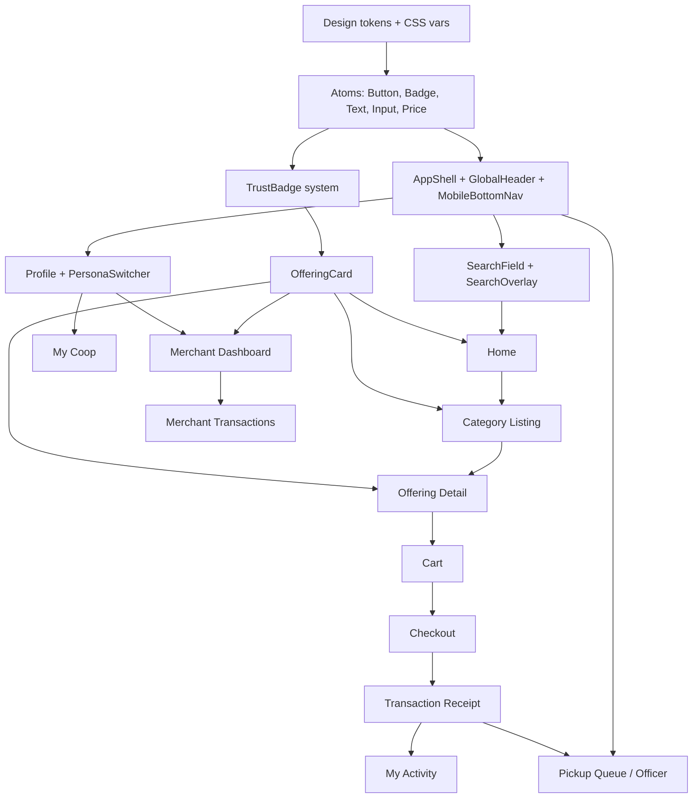

# B2CCoop — UI Blueprint & MVP Screen Inventory

> **Source of truth:** [UX-ARCHITECTURE.md](./UX-ARCHITECTURE.md) — personas, navigation, IA, journeys, and design tokens are **final**. This document translates UX into **implementation-ready** screens, components, sequence, and sprints.  
> **Do not** redesign architecture here — only specify **what to build**, **in what order**, and **why**.

---

## Document map

| Part | Section |
|------|---------|
| 1 | [MVP Screen Inventory](#part-1-mvp-screen-inventory) |
| 2 | [Component Inventory](#part-2-component-inventory) |
| 3 | [Screen Dependency Map](#part-3-screen-dependency-map) |
| 4 | [Empty State Design](#part-4-empty-state-design) |
| 5 | [Trust System](#part-5-trust-system) |
| 6 | [First-Time User Experience](#part-6-first-time-user-experience) |
| 7 | [Frontend Build Roadmap](#part-7-frontend-build-roadmap) |

---

# Part 1: MVP Screen Inventory

### Priority legend

| Priority | Meaning | MVP launch |
|----------|---------|------------|
| **P0** | Required for first public launch (product ORDER flow) | Yes |
| **P1** | Required for coherent unified experience; can ship week 2 | Strongly recommended |
| **P2** | Post-MVP; stub or “coming soon” acceptable at launch | No |

### API legend

| Tag | Meaning |
|-----|---------|
| **Exists** | Live on Store API or WebApp today |
| **Extend** | Partial; needs query params or new fields |
| **New** | Not built; required before screen is functional |

---

## Discover (Customer + all personas)

### Home

| Field | Value |
|-------|-------|
| **Route** | `/` |
| **Purpose** | Front door — categories, featured offerings, member strip, trust footer |
| **Personas** | Customer (default), Member, Merchant, Officer, Admin |
| **Components** | `AppShell`, `HeroBlock`, `CategoryChipRow`, `MemberStrip`, `OfferingCardGrid`, `CampaignBanner`, `TrustFooter` |
| **APIs** | `GET /catalog` (featured subset) **Extend**; `GET /content/pages/home` **New** (CMS); Firebase session optional |
| **Priority** | **P0** |

*MVP fallback:* static hero + `GET /catalog` grid if CMS not ready.

---

### Search

| Field | Value |
|-------|-------|
| **Route** | `/search` (+ overlay from header/bottom nav) |
| **Purpose** | Find offerings, categories, merchants by keyword and location |
| **Personas** | All |
| **Components** | `SearchOverlay`, `SearchField`, `FilterChipRow`, `OfferingCardList`, `EmptyStateSearch` |
| **APIs** | `GET /search?q=&category=&lat=` **New**; MVP: client filter on `GET /catalog` **Exists** |
| **Priority** | **P0** (basic); **P1** (server search + geo) |

---

### Category Listing

| Field | Value |
|-------|-------|
| **Route** | `/c/{categorySlug}` |
| **Purpose** | Browse one category (e.g. Products → Rice) |
| **Personas** | All |
| **Components** | `CategoryHeader`, `FilterChipRow`, `OfferingCardGrid`, `Breadcrumb` |
| **APIs** | `GET /catalog?category=` **Extend**; metadata facets **New** (P2) |
| **Priority** | **P0** |

*MVP:* single `/catalog` with category query; route alias `/c/products` → `?category=products`.

---

### Offering Detail

| Field | Value |
|-------|-------|
| **Route** | `/o/{slug}` (MVP: `/o/{id}` until slugs) |
| **Purpose** | Full listing — price, patronage, trust badges, add to cart / book / inquire |
| **Personas** | All (merchant sees preview if owner) |
| **Components** | `OfferingDetailTemplate`, `MediaGallery`, `PriceBlock`, `PatronageCallout`, `TrustBadgeRow`, `AddToCartBar`, `SellerMiniCard` |
| **APIs** | `GET /offerings/:id` **New** (MVP: map from catalog item by id); `GET /sellers/:id` **New** (P1) |
| **Priority** | **P0** |

*MVP bridge:* deep link from catalog card → detail page using SKU/id from `GET /catalog`.

---

### Merchant Storefront

| Field | Value |
|-------|-------|
| **Route** | `/s/{sellerSlug}` |
| **Purpose** | All listings from one seller; seller story and trust badges |
| **Personas** | All |
| **Components** | `SellerHeader`, `TrustBadgeRow`, `OfferingCardGrid`, `SellerBio` |
| **APIs** | `GET /sellers/:slug/offerings` **New**; MVP: `GET /catalog?vendor=` **Extend** |
| **Priority** | **P1** |

---

## Commerce (Customer + Member)

### Cart

| Field | Value |
|-------|-------|
| **Route** | `/cart` |
| **Purpose** | Review lines, quantities, estimated patronage; proceed to checkout |
| **Personas** | Customer, Member |
| **Components** | `CartLineItem`, `CartSummary`, `PatronageEstimate`, `StickyCheckoutBar` |
| **APIs** | Client-only (localStorage) **Exists**; optional `GET /cart` **New** (P2, logged-in) |
| **Priority** | **P0** |

---

### Checkout

| Field | Value |
|-------|-------|
| **Route** | `/checkout` |
| **Purpose** | Email, optional member sign-in, payment method (pickup / online), place order |
| **Personas** | Customer, Member |
| **Components** | `CheckoutForm`, `PaymentMethodPicker`, `TurnstileWidget`, `MemberSignInPanel`, `OrderSummary` |
| **APIs** | `POST /checkout` **Exists**; Firebase token **Exists**; Turnstile **Extend** |
| **Priority** | **P0** |

---

### Transaction Receipt (supporting)

| Field | Value |
|-------|-------|
| **Route** | `/activity/{transactionId}` (MVP: `/order/{id}`) |
| **Purpose** | Receipt, status stepper, staff confirm (officer), retry failed ledger |
| **Personas** | Customer, Member, Officer |
| **Components** | `TransactionStepper`, `ReceiptSummary`, `StaffConfirmPanel`, `PatronageLine` |
| **APIs** | `GET /orders/:id` **Exists**; `PATCH /admin/orders/:id/confirm-pickup` **Exists** |
| **Priority** | **P0** |

---

## My Activity (Customer + Member + Merchant view of buyer side)

### My Activity (list)

| Field | Value |
|-------|-------|
| **Route** | `/activity` |
| **Purpose** | Unified list — active / completed / needs action |
| **Personas** | Customer, Member (Merchant when buying) |
| **Components** | `ActivityTabs`, `TransactionListItem`, `EmptyStateOrders` |
| **APIs** | `GET /transactions/me?email=` **New**; MVP: guest email lookup **New**; single-order deep link only **Exists** |
| **Priority** | **P1** (list); receipt **P0** |

*MVP bridge:* “Find my order” email form → `GET /orders/:id` after id entry; full list P1.

---

## My Coop (Member)

### My Coop

| Field | Value |
|-------|-------|
| **Route** | `/coop` |
| **Purpose** | Patronage balance, passbook link, membership status, member deals |
| **Personas** | Member (Firebase required) |
| **Components** | `PatronageCard`, `PassbookLinkCard`, `MembershipStatusCard`, `OfferingCardGrid` (member deals) |
| **APIs** | WebApp `GET /api/members/patronage-summary` **Exists**; passbook **Exists**; `GET /catalog?memberPricing=true` **New** |
| **Priority** | **P1** |

*MVP bridge:* patronage card + link to WebApp passbook if embed not ready.

---

## Account shell (all personas)

### Profile

| Field | Value |
|-------|-------|
| **Route** | `/account` |
| **Purpose** | Name, email, sign-in/out, settings entry |
| **Personas** | All |
| **Components** | `ProfileHeader`, `SettingsList`, `SignInButton`, `SignOutButton` |
| **APIs** | Firebase Auth **Exists**; `GET /account/me` **New** (P2) |
| **Priority** | **P1** |

---

### Persona Switcher

| Field | Value |
|-------|-------|
| **Route** | `/account` (section) + drawer from `👤` / **You** tab — not standalone route |
| **Purpose** | Switch lens: Customer, Member, Merchant, Service provider, Officer, Admin |
| **Personas** | All enabled roles |
| **Components** | `PersonaSwitcher`, `PersonaOption`, `OfficerModeBanner` |
| **APIs** | `GET /account/personas` **New** (returns enabled personas from Firebase + seller + staff claims) |
| **Priority** | **P1** |

*MVP:* client-side personas (Customer / Member / Officer-with-secret); full RBAC P1.

---

### Messages

| Field | Value |
|-------|-------|
| **Route** | `/messages`, `/messages/{threadId}` |
| **Purpose** | Per-transaction buyer ↔ seller threads |
| **Personas** | Customer, Member, Merchant |
| **Components** | `ThreadList`, `MessageBubble`, `MessageComposer`, `EmptyStateMessages` |
| **APIs** | `GET /messages/threads` **New**; `POST /messages/threads/:id` **New** |
| **Priority** | **P2** |

*MVP:* bottom nav icon → “Messages coming soon” or hide until P2.

---

### Notifications

| Field | Value |
|-------|-------|
| **Route** | `/notifications` (+ bell drawer) |
| **Purpose** | Order updates, coop announcements, approval results |
| **Personas** | All logged-in |
| **Components** | `NotificationDrawer`, `NotificationItem`, `NotificationFilters`, `EmptyStateNotifications` |
| **APIs** | `GET /notifications` **New**; MVP: static empty + email-only transactional **—** |
| **Priority** | **P2** |

*MVP:* bell opens drawer with empty state + “We’ll notify you by email.”

---

## Sell (Merchant + Service provider)

### Merchant Dashboard

| Field | Value |
|-------|-------|
| **Route** | `/sell` |
| **Purpose** | Overview KPIs, action queue (orders to fulfill, inquiries) |
| **Personas** | Merchant, Service provider |
| **Components** | `MerchantKpiRow`, `ActionQueue`, `QuickLinks`, `EmptyStateListings` |
| **APIs** | `GET /sell/overview` **New**; MVP: `GET /admin/orders/pending` **Exists** (officer overlap) |
| **Priority** | **P1** |

---

### Listings (merchant)

| Field | Value |
|-------|-------|
| **Route** | `/sell/listings` |
| **Purpose** | All seller offerings with status (Draft, Live, Paused, Pending approval) |
| **Personas** | Merchant, Service provider |
| **Components** | `ListingTable` (desktop), `ListingCard` (mobile), `StatusBadge`, `EmptyStateListings` |
| **APIs** | `GET /sell/listings` **New** |
| **Priority** | **P2** |

*MVP:* officer sees catalog seed only; merchant self-serve listings P2.

---

### Listing Wizard

| Field | Value |
|-------|-------|
| **Route** | `/sell/new`, `/sell/new/{step}` |
| **Purpose** | Create offering — type → category → details → price → review |
| **Personas** | Merchant, Service provider |
| **Components** | `WizardProgress`, `TypeTileGrid`, `DynamicMetadataForm`, `WizardReview` |
| **APIs** | `GET /categories/:slug/schema` **New**; `POST /sell/listings` **New** |
| **Priority** | **P2** |

---

### Transactions (merchant fulfillment)

| Field | Value |
|-------|-------|
| **Route** | `/sell/activity` |
| **Purpose** | Orders and bookings to fulfill — mark paid, mark complete |
| **Personas** | Merchant, Service provider, Officer |
| **Components** | `MerchantTransactionList`, `FulfillmentActionBar`, `TransactionStepper` |
| **APIs** | `GET /sell/transactions` **New**; `PATCH /admin/orders/:id/confirm-pickup` **Exists** |
| **Priority** | **P1** |

*MVP:* reuse `/admin` pickup queue styled as Sell → Activity for officer persona.

---

### Payouts

| Field | Value |
|-------|-------|
| **Route** | `/sell/payouts` |
| **Purpose** | Earnings summary, commission breakdown (read-only) |
| **Personas** | Merchant |
| **Components** | `EarningsSummary`, `PayoutTable`, `EmptyStatePayouts` |
| **APIs** | `GET /sell/earnings` **New** (Accounting integration) |
| **Priority** | **P2** |

---

## Administration (Officer + Admin)

### HQ Merchant Approval

| Field | Value |
|-------|-------|
| **Route** | `/admin/merchants` |
| **Purpose** | Approve/reject seller applications |
| **Personas** | Coop officer, Administrator |
| **Components** | `ApprovalQueue`, `ApprovalDetail`, `OfficerModeBanner` |
| **APIs** | `GET /admin/merchants/pending` **New**; `PATCH /admin/merchants/:id` **New** |
| **Priority** | **P2** |

---

### HQ Listing Approval

| Field | Value |
|-------|-------|
| **Route** | `/admin/listings` |
| **Purpose** | Moderate new/changed listings |
| **Personas** | Officer, Admin |
| **Components** | `ApprovalQueue`, `OfferingPreview` |
| **APIs** | `GET /admin/listings/pending` **New**; `PATCH /admin/listings/:id` **New** |
| **Priority** | **P2** |

---

### Pickup Queue (MVP officer — exists)

| Field | Value |
|-------|-------|
| **Route** | `/admin` (MVP) → `/sell/activity` or `/admin/pickup` (target) |
| **Purpose** | Confirm pickup payment → post ledger |
| **Personas** | Officer |
| **Components** | `PickupQueue`, `StaffConfirmPanel` |
| **APIs** | `GET /admin/orders/pending` **Exists**; confirm **Exists** |
| **Priority** | **P0** |

---

### CMS Homepage Editor

| Field | Value |
|-------|-------|
| **Route** | `/admin/content/home` |
| **Purpose** | HQ edits homepage blocks (hero, featured, banners) |
| **Personas** | Administrator |
| **Components** | `CmsBlockList`, `CmsPreview`, `BlockEditor`, `PublishBar` |
| **APIs** | `GET/PUT /admin/content/pages/home` **New** |
| **Priority** | **P2** |

---

## MVP launch screen set (minimum)

**P0 — ship first:**

| # | Screen | Route |
|---|--------|-------|
| 1 | Home | `/` |
| 2 | Search (basic) | `/search` |
| 3 | Category Listing | `/c/{slug}` or `/catalog` |
| 4 | Offering Detail | `/o/{id}` |
| 5 | Cart | `/cart` |
| 6 | Checkout | `/checkout` |
| 7 | Transaction Receipt | `/order/{id}` |
| 8 | Pickup Queue | `/admin` |

**P1 — unified experience (launch +2 weeks):**

| # | Screen | Route |
|---|--------|-------|
| 9 | My Activity | `/activity` |
| 10 | My Coop | `/coop` |
| 11 | Profile + Persona Switcher | `/account` |
| 12 | Merchant Dashboard | `/sell` |
| 13 | Merchant Transactions | `/sell/activity` |
| 14 | Merchant Storefront | `/s/{slug}` |

**P2 — post-MVP:**

Messages, Notifications (functional), Listings wizard, Payouts, HQ approvals, CMS editor.

---

# Part 2: Component Inventory

Hierarchy follows UX-ARCHITECTURE component tree. **Shared** = used by all personas unless noted.

---

## Atoms

| Component | Responsibilities | Props (key) | Variants | States | A11y | Shared |
|-----------|------------------|-------------|----------|--------|------|--------|
| `Button` | Single action | `label`, `onClick`, `disabled`, `loading` | `primary`, `secondary`, `ghost`, `danger` | default, hover, focus, disabled, loading | `aria-busy`, focus ring, 44px min height | Yes |
| `Icon` | Decorative / semantic icon | `name`, `size`, `label?` | sizes: sm, md, lg | — | `aria-hidden` or `aria-label` | Yes |
| `Text` | Typography scale | `as`, `variant`, `children` | display, title, body, caption | — | semantic heading order | Yes |
| `Badge` | Status or trust label | `children`, `tone` | see Trust System | — | text ≥ 12px, not color-only | Yes |
| `Avatar` | User or seller image | `src`, `alt`, `fallback` | sm, md, lg | loading, error | meaningful `alt` | Yes |
| `Input` | Text entry | `label`, `error`, `type`, `value` | default, error | focus, disabled, error | `label` linked, `aria-invalid` | Yes |
| `Select` | Single choice | `label`, `options`, `value` | — | open, disabled | keyboard nav | Yes |
| `Checkbox` / `Radio` | Form choice | `label`, `checked` | — | focus, disabled | large hit area | Yes |
| `Spinner` | Loading | `size`, `label` | sm, md | — | `role="status"` | Yes |
| `Divider` | Visual separation | `orientation` | horizontal, vertical | — | `role="separator"` | Yes |
| `Price` | Formatted money | `amount`, `currency`, `from?` | member, standard | — | screen reader reads full amount | Yes |
| `PatronageAmount` | Patronage display | `amount` | inline, block | — | “Patronage” prefix spoken | Yes |
| `VisuallyHidden` | Screen reader only | `children` | — | — | — | Yes |

---

## Molecules

| Component | Responsibilities | Props (key) | Variants | States | A11y | Shared |
|-----------|------------------|-------------|----------|--------|------|--------|
| `SearchField` | Query input + submit | `value`, `onSearch`, `placeholder` | header, overlay | focus | `role="search"` | Yes |
| `FilterChip` | Toggle filter | `label`, `active`, `onToggle` | — | active, inactive | `aria-pressed` | Yes |
| `CategoryChip` | Category nav | `slug`, `label`, `icon` | — | default, active | keyboard activatable | Yes |
| `TrustBadge` | Trust signal | `type` (enum) | see Part 5 | — | text label + icon | Yes |
| `StatusBadge` | Transaction/listing status | `status` | order, listing | — | plain language label | Yes |
| `Breadcrumb` | Location trail | `items[]` | — | — | `nav` + `aria-current` | Yes |
| `EmptyState` | Zero-data UX | `title`, `body`, `cta?` | per context | — | heading + description | Yes |
| `Toast` | Feedback | `message`, `tone` | success, error, info | enter, exit | `role="alert"` live region | Yes |
| `FormField` | Label + input + error | `label`, `error`, `children` | — | error | `aria-describedby` | Yes |
| `QuantityStepper` | Cart qty | `value`, `min`, `max`, `onChange` | — | — | button labels “Increase/Decrease” | Customer |
| `PaymentMethodCard` | Pickup vs online | `selected`, `method` | pickup, online | selected | radio group | Customer |
| `PersonaOption` | Persona radio row | `persona`, `selected`, `enabled` | — | disabled if not enabled | `role="radio"` | Yes |
| `NotificationItem` | Single alert | `title`, `body`, `time`, `read` | — | unread | mark read action | Yes |
| `MessageBubble` | Chat line | `body`, `sender`, `time` | sent, received | — | — | P2 |
| `KpiCard` | Metric tile | `label`, `value`, `hint?` | — | loading | — | Merchant |
| `SellerMiniCard` | Seller on detail | `seller`, `badges` | — | — | link to storefront | Yes |
| `MediaThumb` | Offering image | `src`, `alt` | — | loading, error | alt = offering name | Yes |

---

## Organisms

| Component | Responsibilities | Props (key) | Variants | States | A11y | Shared |
|-----------|------------------|-------------|----------|--------|------|--------|
| `GlobalHeader` | Logo, nav, search, bell, account | `persona`, `cartCount` | desktop, mobile | — | skip link to main | Yes |
| `MobileBottomNav` | 5-tab nav | `activeTab`, `cartCount`, `unread` | — | — | `nav` labels | Yes |
| `PersonaSwitcher` | Persona lens UI | `current`, `options`, `onChange` | drawer, dropdown | — | announce persona change | Yes |
| `OfficerModeBanner` | Officer context | `visible` | — | — | `role="status"` | Officer |
| `AccountMenu` | Profile dropdown | `user`, `personas` | — | open | focus trap in drawer mobile | Yes |
| `NotificationDrawer` | Bell panel | `notifications`, `onClose` | — | empty, loading | focus trap | Yes |
| `SearchOverlay` | Full-screen search | `open`, `onClose` | — | loading, results, empty | focus trap, Esc close | Yes |
| `OfferingCard` | Universal listing card | `offering`, `onAction` | product, service, tour, … | loading, unavailable, member-only | CTA name includes offering title | Yes |
| `OfferingCardGrid` | Responsive grid | `offerings`, `loading` | 1-col mobile, 2+ desktop | loading, empty | — | Yes |
| `OfferingDetailHero` | Detail top section | `offering` | by type | — | — | Yes |
| `AddToCartBar` | Sticky CTA | `offering`, `quantity` | order, booking, inquiry | disabled | sticky not blocking focus | Customer |
| `CartLineItem` | Cart row | `line`, `onQtyChange` | — | — | — | Customer |
| `CartSummary` | Totals + patronage | `lines` | — | — | — | Customer |
| `CheckoutForm` | Guest/member checkout | `onSubmit`, `loading` | — | submitting, error | error summary top | Customer |
| `TransactionListItem` | Activity row | `transaction` | order, booking, inquiry | — | status text plain language | Yes |
| `TransactionStepper` | Workflow visual | `steps`, `current` | — | — | `aria-current="step"` | Yes |
| `StaffConfirmPanel` | Officer confirm pay | `orderId`, `onConfirm` | — | loading, error | password field labeled | Officer |
| `PatronageCard` | Member patronage | `summary` | — | loading, empty | — | Member |
| `PassbookLinkCard` | Link to passbook | `href` | — | — | — | Member |
| `MemberStrip` | Home member CTA | `loggedIn`, `balance?` | — | — | — | Yes |
| `HeroBlock` | CMS hero | `title`, `cta`, `image` | — | — | — | Yes |
| `CampaignBanner` | Promo strip | `campaign` | — | dismissible | dismiss button labeled | Yes |
| `ActionQueue` | Merchant to-dos | `items` | — | empty | each action one button | Merchant |
| `PickupQueue` | Pending pickup list | `orders`, `onConfirm` | — | empty, loading | — | Officer |
| `WizardProgress` | Step indicator | `step`, `total` | — | — | “Step X of Y” | Merchant |
| `DynamicMetadataForm` | Category fields | `schema`, `values` | — | validating | field errors linked | Merchant |
| `ApprovalQueue` | HQ moderation list | `items`, `type` | merchant, listing | — | — | Admin |
| `CmsBlockList` | Homepage editor | `blocks`, `onChange` | — | — | — | Admin |
| `TrustFooter` | Coop legal/trust | — | — | — | — | Yes |

---

## Templates

| Template | Responsibilities | Composes | Personas |
|----------|------------------|----------|----------|
| `AppShell` | Layout wrapper | `GlobalHeader`, `MobileBottomNav`, `main`, `TrustFooter`, optional `OfficerModeBanner` | All |
| `DiscoverTemplate` | Browse pages | `CategoryChipRow` or filters + `OfferingCardGrid` | All |
| `OfferingDetailTemplate` | Detail page | `OfferingDetailHero`, `PriceBlock`, `PatronageCallout`, `TrustBadgeRow`, `AddToCartBar` | All |
| `CheckoutTemplate` | Checkout flow | `CheckoutForm`, `OrderSummary` | Customer, Member |
| `ActivityTemplate` | My activity | `ActivityTabs`, list of `TransactionListItem` | Customer, Member |
| `CoopTemplate` | My Coop | `PatronageCard`, `PassbookLinkCard`, deals grid | Member |
| `SellDashboardTemplate` | Merchant home | `MerchantKpiRow`, `ActionQueue` | Merchant |
| `SellListingsTemplate` | Listing management | `ListingCard` list | Merchant |
| `WizardTemplate` | Create listing | `WizardProgress`, step body, nav buttons | Merchant |
| `AdminQueueTemplate` | HQ queues | `ApprovalQueue`, detail drawer | Officer, Admin |
| `AccountTemplate` | Profile + persona | `ProfileHeader`, `PersonaSwitcher`, `SettingsList` | All |
| `AuthGateTemplate` | Login required | `EmptyState` + sign-in CTA | Member-gated screens |

---

## Shared-across-personas summary

**Always shared:** `AppShell`, `GlobalHeader`, `MobileBottomNav`, `Button`, `OfferingCard`, `TrustBadge`, `StatusBadge`, `EmptyState`, `PersonaSwitcher`, `TransactionListItem`, `TransactionStepper`, design tokens.

**Persona-conditional (same component, different data/actions):** `ActionQueue` (merchant vs officer), `AddToCartBar` (customer vs merchant preview).

**Persona-exclusive screens:** `PatronageCard` (Member), `StaffConfirmPanel` (Officer), `CmsBlockList` (Admin).

---

# Part 3: Screen Dependency Map

### Dependency graph (build order)

### Optimal development sequence (with rationale)

| Step | Build | Why |
|------|-------|-----|
| 1 | Design tokens + atoms | One visual language before pages |
| 2 | `AppShell` + bottom nav + header | Every screen depends on this |
| 3 | `TrustBadge` + `StatusBadge` | Required on cards and detail from day one |
| 4 | `OfferingCard` + `OfferingCardGrid` | Reused on Home, Category, Search, Coop, Sell |
| 5 | `SearchOverlay` + basic `/search` | High discoverability; unblocks Home search entry |
| 6 | **Home** `/` | Validates shell + cards + CMS fallback |
| 7 | **Category Listing** `/c/{slug}` | Reuses grid; adds filters |
| 8 | **Offering Detail** `/o/{id}` | Unblocks cart actions |
| 9 | **Cart** + **Checkout** | Revenue path |
| 10 | **Transaction Receipt** `/order/{id}` | Completes buyer loop |
| 11 | **Profile + PersonaSwitcher** | Unifies experiences before dashboards |
| 12 | **Pickup Queue** `/admin` | Officer P0; reuse receipt components |
| 13 | **My Activity** `/activity` | Unified buyer history |
| 14 | **My Coop** `/coop` | Member retention |
| 15 | **Merchant Dashboard** + **Sell activity** | Seller/officer fulfillment |
| 16 | P2 screens | Messages, notifications, wizard, CMS, payouts |

### Screen → component dependencies

| Screen | Must exist first |
|--------|------------------|
| Home | AppShell, OfferingCard, CategoryChip, HeroBlock (optional) |
| Category Listing | OfferingCardGrid, FilterChip |
| Offering Detail | OfferingCard data model, AddToCartBar, TrustBadgeRow |
| Cart | CartLineItem, CartSummary |
| Checkout | CheckoutForm, PaymentMethodCard |
| Receipt | TransactionStepper, StaffConfirmPanel |
| My Activity | TransactionListItem, ActivityTabs |
| My Coop | PatronageCard, OfferingCard |
| Sell dashboard | ActionQueue, KpiCard |
| Persona Switcher | AppShell AccountMenu |

---

# Part 4: Empty State Design

Plain-language copy for low literacy. Every empty state: **icon + title + one sentence + one CTA**.

| Context | Title | Body | CTA |
|---------|-------|------|-----|
| **No listings** (merchant) | No listings yet | When you add a product or service, it will show here. | Add your first listing |
| **No listings** (category) | Nothing here yet | We’re adding more from coop and members. Try another category. | Browse all |
| **No orders** (activity) | No orders yet | When you buy something, your receipts will show here. | Start shopping |
| **No orders** (merchant) | No orders to fill | New orders from customers will appear here. | Share your store |
| **No bookings** | No bookings yet | Your scheduled services and tours will show here. | Browse services |
| **No benefits** (coop) | Sign in to see coop benefits | Track patronage and member savings with your coop account. | Sign in |
| **No benefits** (member, zero balance) | Your patronage is ₱0.00 | Every purchase at the coop store adds patronage for members. | Shop member deals |
| **No messages** | No messages yet | When you order or book, you can chat with the seller here. | — |
| **No search results** | No matches found | Try fewer words or check spelling. | Clear search |
| **No notifications** | You’re all caught up | We’ll tell you here when something needs your attention. | — |
| **No payouts** | No earnings yet | Sales and commissions will show here after you make sales. | — |
| **Cart empty** | Your cart is empty | Add items from the catalog to checkout. | Browse catalog |
| **Guest activity lookup** | Find your order | Enter the email you used at checkout. | — |
| **Approval queue empty** | All caught up | No sellers or listings waiting for approval. | — |

### Visual pattern

- Centered illustration (simple line icon, not clipart-heavy).
- No blame (“You haven’t…” → neutral “No orders yet”).
- Single primary button; secondary optional text link.

---

# Part 5: Trust System

### Badge hierarchy (priority when multiple apply)

Highest trust wins **primary** slot (top-left of card); others stack as secondary chips.

| Priority | Badge ID | User label | Who qualifies |
|----------|----------|------------|---------------|
| 1 | `coop-official` | B2CCoop Coop Store | `seller_kind = COOP` |
| 2 | `partner-official` | Official Partner | `seller_kind = PARTNER` + HQ verified |
| 3 | `coop-recommended` | B2CCoop Recommended | HQ curated flag |
| 4 | `merchant-verified` | Verified Merchant | Onboarding + officer approved |
| 5 | `member-seller` | Member Seller | `seller_kind = MEMBER` + `participantId` |
| 6 | `service-trusted` | Trusted Service Provider | SERVICE type + rating threshold + verified |

### Visual treatment (from UX design tokens)

| Badge | Background | Text | Icon |
|-------|------------|------|------|
| Coop official | `#ecfdf5` | `#047857` | Coop seal |
| Official partner | `#eff6ff` | `#1d4ed8` | handshake |
| Recommended | `#fffbeb` | `#b45309` | star |
| Verified merchant | `#f0fdf4` | `#15803d` | checkmark shield |
| Member seller | `#f0f9ff` | `#0369a1` | person |
| Trusted service | `#f5f3ff` | `#6d28d9` | wrench + check |

### Placement rules

| Surface | Rule |
|---------|------|
| `OfferingCard` | Primary badge top-left on image; max 2 visible |
| Offering detail | Full `TrustBadgeRow` under title |
| Merchant storefront | All applicable badges in `SellerHeader` |
| Checkout | Coop seal + “Member-owned marketplace” one-liner |
| Footer | Registration number, pickup address, help phone |

### Accessibility

- Never rely on color alone — always icon + text label.
- Tooltip optional; label must be visible on detail pages.

---

# Part 6: First-Time User Experience

### Principles

- **Browse first** — no sign-in wall on Home.
- **One question per step** — onboarding modals max 3 steps.
- **Skip always visible** — “Not now”.

---

### Guest

| Step | When | Content | Action |
|------|------|---------|--------|
| G1 | First visit Home | Bottom sheet: “Welcome to your coop marketplace” | Browse / Sign in |
| G2 | First add to cart | Toast: “No account needed to checkout” | — |
| G3 | Checkout | Email field helper: “We’ll send your receipt here” | — |
| G4 | Post-receipt | Card: “Sign in to track patronage as a member” | Sign in / Skip |

No account required for G1–G3.

---

### Member

| Step | When | Content | Action |
|------|------|---------|--------|
| M1 | First sign-in | “You’re signed in as a member” — show member ID if available | Continue |
| M2 | First Home visit (member) | `MemberStrip` with patronage explainer | View My Coop |
| M3 | First checkout as member | Highlight member pricing / patronage line | — |
| M4 | Incomplete PMES (from WebApp) | Banner: “Finish membership steps” — link out | Continue later |

Persona auto-switches to **Member** when `Participant.id` resolved.

---

### Merchant

| Step | When | Content | Action |
|------|------|---------|--------|
| S1 | Tap Sell (no seller profile) | “Start selling with the coop” — 3 bullets: list, fulfill, earn | Start |
| S2 | Onboarding form | Business name, type (member/corporate), contact | Submit |
| S3 | Pending approval | “We’re reviewing your application” | Back to shop |
| S4 | Approved | Confetti-lite toast + redirect to Sell dashboard | Create listing |

Service provider: same as merchant + S5 calendar prompt (P2).

---

### Service provider

| Step | When | Content | Action |
|------|------|---------|--------|
| SP1 | After S4 (approved) | “Set your service area and schedule” | Set up / Later |
| SP2 | First BOOKING offering | Wizard pre-selects BOOKING model | — |

MVP: SP steps are P2; merchant onboarding stub only.

---

### Cooperative officer

| Step | When | Content | Action |
|------|------|---------|--------|
| O1 | First officer persona select | Amber `OfficerModeBanner`: “You are managing the marketplace” | I understand |
| O2 | First queue visit | Coach marks on pickup confirm | Dismiss |
| O3 | Wrong persona | If staff action on customer view, prompt switch to Officer | Switch |

Officer uses same shell — no separate app.

---

# Part 7: Frontend Build Roadmap

Sprints assume **2-week cadence**, one team, mobile-first. Backend API tasks run in parallel where noted.

---

## Sprint 1 — Foundation

**Goal:** Every future screen shares one shell and design language.

| Deliverable | Screens / components | API |
|-------------|---------------------|-----|
| Design tokens in CSS | All | — |
| Atoms: Button, Text, Badge, Input, Price, PatronageAmount | All | — |
| `AppShell`, `GlobalHeader`, `MobileBottomNav` | All | — |
| `TrustBadge` + placement on placeholder | All | — |
| `EmptyState` base component | All | — |
| Route stubs (empty pages) | All P0 routes | — |
| Migrate `/catalog` → shell | Category (partial) | `GET /catalog` Exists |

**Exit criteria:** Navigate all P0 routes on mobile without 404; consistent header/footer.

---

## Sprint 2 — Marketplace browsing

**Goal:** Discover → Detail without checkout.

| Deliverable | Screens | API |
|-------------|---------|-----|
| `OfferingCard`, `OfferingCardGrid` | Home, Category, Search | `GET /catalog` |
| `CategoryChip`, `HeroBlock`, `MemberStrip` | Home | CMS fallback static |
| **Home** `/` | Home | catalog |
| **Category Listing** `/c/{slug}` | Category | catalog filter |
| `SearchOverlay` + **Search** `/search` | Search | client filter MVP |
| **Offering Detail** `/o/{id}` | Detail | catalog by id |
| `SellerMiniCard`, `TrustBadgeRow` | Detail | vendor from catalog |
| Guest onboarding G1, G2 | Home, cart | — |

**Exit criteria:** User can browse home → category → detail on phone; trust badges visible.

---

## Sprint 3 — Transactions

**Goal:** Complete product ORDER loop (guest + officer).

| Deliverable | Screens | API |
|-------------|---------|-----|
| `CartLineItem`, `CartSummary`, `StickyCheckoutBar` | Cart | localStorage |
| **Cart** `/cart` | Cart | — |
| `CheckoutForm`, `PaymentMethodCard` | Checkout | `POST /checkout` |
| **Checkout** `/checkout` | Checkout | Exists |
| `TransactionStepper`, `StaffConfirmPanel` | Receipt | `GET /orders/:id` |
| **Transaction Receipt** `/order/{id}` | Receipt | Exists |
| **Pickup Queue** `/admin` | Officer | admin pending + confirm |
| Guest G3, G4; Officer O1 | Checkout, receipt, admin | — |

**Exit criteria:** E2E guest purchase → pickup confirm → POSTED_TO_LEDGER (with Accounting up).

---

## Sprint 4 — Merchant tools

**Goal:** Persona switching + sell-side fulfillment views.

| Deliverable | Screens | API |
|-------------|---------|-----|
| `PersonaSwitcher`, `AccountMenu`, `OfficerModeBanner` | Account | personas API stub |
| **Profile** `/account` | Account | Firebase |
| **Merchant Dashboard** `/sell` | Sell | overview stub |
| `ActionQueue`, `PickupQueue` reuse | Sell, Admin | pending orders |
| **Merchant Transactions** `/sell/activity` | Sell | admin APIs |
| Merchant onboarding S1–S3 (UI only) | Sell | New (stub) |
| Officer O2 | Admin | — |

**Exit criteria:** Officer switches persona, fulfills queue from `/sell/activity`; merchant sees dashboard shell.

---

## Sprint 5 — Membership layer

**Goal:** Member differentiation without leaving marketplace.

| Deliverable | Screens | API |
|-------------|---------|-----|
| `PatronageCard`, `PassbookLinkCard` | Coop | WebApp patronage/passbook |
| **My Coop** `/coop` | Coop | Exists (WebApp) |
| `ActivityTabs`, `TransactionListItem` | Activity | `GET /transactions/me` New |
| **My Activity** `/activity` | Activity | New |
| Member onboarding M1–M4 | Coop, checkout | member resolve |
| **Merchant Storefront** `/s/{slug}` | Storefront | catalog by vendor |
| Member pricing on `PriceBlock` | Detail | Extend |

**Exit criteria:** Member sees patronage on Coop page; activity lists orders by email.

> **Out of sprint scope:** [VALUE-ENGINE.md](./VALUE-ENGINE.md) (Booster Credits, Pending Credits, referrals) is **Platform Phase P4** — not Sprint 5 or earlier. Sprint 5 uses existing patronage + passbook link only.

---

## Sprint 6 — Administration & growth

**Goal:** HQ tooling and P2 surfaces (stubs acceptable).

| Deliverable | Screens | API |
|-------------|---------|-----|
| `NotificationDrawer` + empty state | Notifications | New (P2) |
| Messages placeholder | Messages | P2 |
| `ApprovalQueue` | HQ merchants/listings | New |
| **HQ Merchant Approval** `/admin/merchants` | Admin | New |
| `CmsBlockList` + **CMS Homepage Editor** | Admin | New |
| **Listing Wizard** (product only) | `/sell/new` | New |
| **Payouts** `/sell/payouts` | Sell | New |
| Service provider SP1 (schedule UI) | Sell | P2 |

**Exit criteria:** HQ can edit homepage hero (min); listing wizard creates product draft.

---

## Cross-sprint technical notes

| Topic | Decision |
|-------|----------|
| **Framework** | Astro + islands for storefront (current); shared component package `@b2ccoop/store-ui` recommended Sprint 1 |
| **State** | Cart: localStorage MVP; persona: sessionStorage; auth: Firebase |
| **API base** | `PUBLIC_API_URL` — Store Worker |
| **Member data** | Proxy WebApp patronage via Store BFF or direct with CORS (existing pattern) |
| **Route migration** | Keep `/catalog`, `/order/:id`, `/admin` aliases until redirects in place |

---

## MVP launch checklist (from this blueprint)

- [ ] P0 screens Sprint 1–3 complete
- [ ] Trust badges on all offering surfaces
- [ ] Mobile bottom nav on all screens
- [ ] Empty states for cart, search, activity
- [ ] Officer pickup queue styled in unified shell
- [ ] `store.b2ccoop.com` custom domain live
- [ ] P1 Sprint 4–5 within 4 weeks of launch (recommended)

---

## Related documents

- [UX-ARCHITECTURE.md](./UX-ARCHITECTURE.md) — personas, nav, wireframes (final)
- [MARKETPLACE-DOMAIN.md](./MARKETPLACE-DOMAIN.md) — offerings, transactions
- [PLATFORM-CORE-SERVICES.md](./PLATFORM-CORE-SERVICES.md) — backend capabilities
- [DEPLOY-PHASE-2B.md](./DEPLOY-PHASE-2B.md) — production deploy
