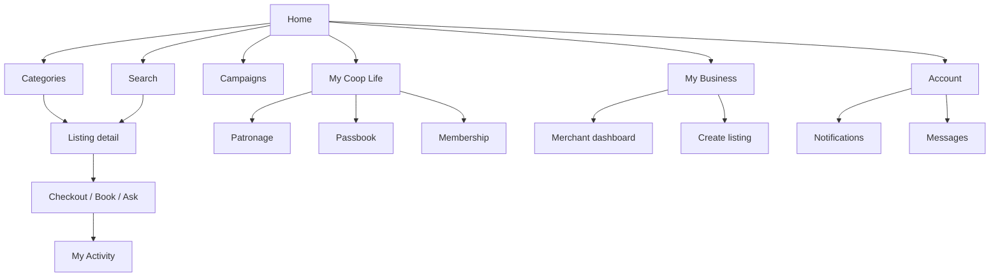
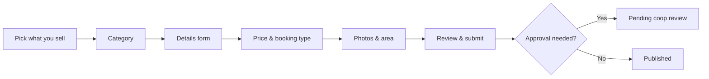

# B2CCoop — Complete UX Architecture

> **Goal:** One cooperative marketplace where a single account can shop, earn patronage, sell, provide services, and govern — **without feeling like multiple apps**.  
> **Audience:** Members and guests with **low technical literacy** — large touch targets, plain language, progressive disclosure.  
> **Aligns with:** [MARKETPLACE-DOMAIN.md](./MARKETPLACE-DOMAIN.md), [PLATFORM-CORE-SERVICES.md](./PLATFORM-CORE-SERVICES.md)

---

## Design principles

| Principle | What it means in UX |
|-----------|---------------------|
| **One front door** | `b2ccoop.com` / app shell — never “go to the Store app” vs “WebApp” in user-facing copy |
| **One sign-in** | Firebase — same email everywhere |
| **Context, not apps** | Persona switching changes **what you see**, not **where you log in** |
| **Plain language** | “My orders” not “Transaction center”; “Sell something” not “Create offering” |
| **Mobile first** | Thumb-zone navigation; max 2 taps to search or cart |
| **Trust by default** | Coop badge, member pricing, patronage shown on every purchase path |

---

## 1. Information Architecture

### Top-level domains (mental model for users)

Users think in **five places**, not sixteen systems:

```
Discover → Buy / Book → My Coop Life → My Business → Help & Account
```

| User-facing zone | Contains | Hidden complexity |
|------------------|----------|-------------------|
| **Discover** | Home, categories, search, campaigns | Offering types, metadata categories |
| **Buy / Book** | Product cart, service booking, inquiries | ORDER / BOOKING / INQUIRY / LEAD models |
| **My Coop Life** | Patronage, passbook, membership, dividends signals | WebApp lifecycle, Accounting |
| **My Business** | Listings, orders to fulfill, earnings, schedule | Seller kinds, commission engine |
| **Help & Account** | Profile, messages, notifications, settings | RBAC, personas |

### IA map (content types)



### URL strategy (one hostname)

| Path | Purpose |
|------|---------|
| `/` | Homepage |
| `/c/{category}` | Category hub |
| `/o/{slug}` | Offering detail (all types) |
| `/search` | Global search |
| `/cart` | Cart (ORDER model) |
| `/activity` | Unified transaction center |
| `/coop` | Member dashboard |
| `/sell` | Merchant / provider dashboard |
| `/sell/new` | Listing creation wizard |
| `/account` | Profile, personas, settings |
| `/messages` | Messaging |
| `/notifications` | Notification center |
| `/admin` | Officer / HQ (gated) |

Production target: **`store.b2ccoop.com`** for marketplace paths; **`b2ccoop.com`** redirects or embeds same shell (Phase 3+). Users see one brand.

---

## 2. Navigation Architecture

### Global header (desktop)

```
┌─────────────────────────────────────────────────────────────────────────┐
│ [B2CCoop logo]   Shop ▾   My Coop   Sell   🔍 Search...        🔔  👤 ▾ │
└─────────────────────────────────────────────────────────────────────────┘
```

| Item | Behavior |
|------|----------|
| **Shop ▾** | Mega-menu: Products, Services, Tours, Rentals, Finance & insurance, Events |
| **My Coop** | Member dashboard (patronage, passbook) — login required |
| **Sell** | Merchant dashboard or “Start selling” CTA if no seller profile |
| **Search** | Expands to global search overlay |
| **🔔** | Notification center drawer |
| **👤** | Account menu + **persona switcher** |

### Account menu + persona switcher

```
┌──────────────────────────┐
│ Ana Demo Member          │
│ member.demo@b2ccoop.test │
├──────────────────────────┤
│ Viewing as: Customer  ▾  │  ← persona switcher
│   ○ Customer             │
│   ○ Member               │
│   ○ Merchant             │
│   ○ Service provider     │
│   ○ Coop officer         │
│   ○ Administrator        │
├──────────────────────────┤
│ My activity              │
│ Messages                 │
│ Settings                 │
│ Sign out                 │
└──────────────────────────┘
```

Only personas **enabled for this account** appear (no empty admin link for guests).

### Navigation tree

```
B2CCoop
├── Shop
│   ├── Products
│   ├── Services
│   ├── Tours & travel
│   ├── Rentals
│   ├── Finance & insurance
│   └── Events & tickets
├── My Coop (member)
│   ├── Patronage
│   ├── Share capital / passbook
│   ├── Membership status
│   └── Member benefits
├── Sell (merchant / provider)
│   ├── Overview
│   ├── My listings
│   ├── Orders & bookings
│   ├── Calendar & availability
│   ├── Earnings
│   └── Create listing
├── My activity (all personas)
│   ├── Active
│   ├── Completed
│   └── Needs action
├── Messages
├── Notifications
├── Account & settings
└── Admin (officer / HQ only)
    ├── Approve sellers
    ├── Approve listings
    ├── Campaigns & homepage
    └── Reports
```

---

## 3. Persona Switching Model

### Concept

**One identity, multiple hats.** Persona is a **UI lens** on permissions — not a separate login.

| Persona | User sees | Typical entry |
|---------|-----------|---------------|
| **Customer** | Shop, cart, guest checkout | Default for everyone |
| **Member** | + patronage, member pricing, passbook | After PMES sync / `Participant.id` |
| **Merchant** | Sell dashboard, listings, order fulfillment | After seller onboarding |
| **Service provider** | Same as merchant + calendar, service areas | Seller kind + SERVICE/TOUR |
| **Coop officer** | Approvals, campaigns, member support queues | Staff JWT role |
| **Administrator** | Full HQ config | HQ admin role |

### Rules

1. **Default persona:** Customer (or Member if logged in with active membership).
2. **Persist choice** in session: `persona=member` — not a new auth token.
3. **Switching is instant** — same page reloads contextual nav only.
4. **Never say “PMES” or “Store API”** — say “Your coop account” / “Marketplace”.
5. **Officer/Admin** opens **same shell** with amber accent bar: “You are managing the coop marketplace.”

### Persona → route guard (implementation note)

| Persona | Guard |
|---------|-------|
| Customer | Public + own transactions |
| Member | Firebase + `Participant.id` |
| Merchant | Firebase + `seller_id` |
| Officer | Staff JWT or Firebase + role |
| Admin | Staff JWT + HQ role |

---

## 4. Homepage UX

### Purpose

Answer in 5 seconds: **What can I do here?** and **Why is this different from Shopee?**

### Wireframe (mobile)

```
┌─────────────────────────────┐
│ B2CCoop          🔍    🔔 👤│
├─────────────────────────────┤
│ ┌─────────────────────────┐ │
│ │  Hero: Member-owned     │ │
│ │  marketplace for our    │ │
│ │  community               │ │
│ │  [Browse deals]          │ │
│ └─────────────────────────┘ │
│ Shop by category            │
│ [Rice] [Services] [Tours]   │
│ [Rentals] [Loans] [More]    │
│                             │
│ ── For members ──           │
│ Patronage on every purchase │
│ [Sign in to track yours]    │
│                             │
│ ── Featured ──              │
│ ┌──────┐ ┌──────┐           │
│ │ card │ │ card │  → scroll  │
│ └──────┘ └──────┘           │
│                             │
│ ── From coop & members ──   │
│ [offering cards...]         │
│                             │
│ ── Campaign banner ──       │
│                             │
├─────────────────────────────┤
│ 🏠  🔍  🛒  💬  👤         │
└─────────────────────────────┘
```

### Homepage sections (CMS-driven)

| Block | Content |
|-------|---------|
| Hero | Seasonal message + primary CTA |
| Category chips | 6–8 top categories |
| Member strip | Patronage explainer (logged-out) or balance teaser (logged-in) |
| Featured offerings | Curated grid |
| Merchant spotlights | Seller stories |
| Campaign | Banner → landing page |
| Trust footer | Coop registration, pickup locations, help hotline |

### Low-literacy patterns

- Icons + short labels on every category (no jargon).
- “Member prices” badge visible without opening listing.
- Single primary button per section (not 4 equal CTAs).

---

## 5. Search UX

### Entry points

- Header search field (desktop).
- Bottom nav **Search** tab (mobile).
- Category hub “Search within…”

### Search flow

```
Type query → Suggestions (offerings, categories, sellers)
          → Results with filters (simple chips)
          → Listing detail
```

### Wireframe (results)

```
┌─────────────────────────────┐
│ ←  [ electrician      ] 🔍  │
├─────────────────────────────┤
│ Filters: Near me | Member   │
│          deals | ★ Rated      │
├─────────────────────────────┤
│ 12 results near Cebu City   │
│ ┌─────────────────────────┐ │
│ │ [Offering card]         │ │
│ └─────────────────────────┘ │
│ ┌─────────────────────────┐ │
│ │ [Offering card]         │ │
│ └─────────────────────────┘ │
└─────────────────────────────┘
```

### Search behavior

| Feature | UX |
|---------|-----|
| **Autocomplete** | Offerings + categories + “electrician in Mandaue” |
| **Location** | “Near me” or barangay picker (geo engine) |
| **Filters** | Max 5 visible chips; “More filters” sheet |
| **Empty state** | “Try fewer words” + popular categories |
| **Voice** (future) | Mic icon — Phase 2+ |

---

## 6. Listing Creation Wizard

### Principles

- **Metadata-driven** — steps change by category, not by engineer.
- **Progress bar** — “Step 2 of 4”.
- **Save draft** — always visible.
- **Plain steps** — What → Price → Photos → Review.

### Wizard flow



### Step 1 — Pick type (visual tiles)

```
What are you listing?
[🛒 Product]  [🔧 Service]  [✈️ Tour]
[🚗 Rental]   [📋 Loan/Insurance]  [🎫 Event]
```

### Step 2 — Category (examples)

- Service → Skilled trades → **Electrician**
- Dynamic form from metadata framework

### Step 3 — Details (category-specific)

Electrician example: service area map, license #, hourly rate, emergency yes/no.

### Step 4 — How customers get it

| Option | User label | System |
|--------|------------|--------|
| Buy now / pickup | “Customers order and pay” | ORDER |
| Book a time | “Customers book an appointment” | BOOKING |
| Ask for quote | “Customers send a request first” | INQUIRY |
| Express interest | “We contact them” | LEAD |

### Step 5 — Review

Plain-language summary + coop policy checkbox.

---

## 7. Merchant Dashboard

### Layout (desktop)

```
┌──────────┬────────────────────────────────────────┐
│ Overview │  Good morning, Ben                     │
│ Listings │  ┌────────┐ ┌────────┐ ┌────────┐    │
│ Orders   │  │ Sales  │ │ Open   │ │ Rating │    │
│ Bookings │  │ ₱12.4k │ │ orders │ │ 4.8    │    │
│ Calendar │  └────────┘ └────────┘ └────────┘    │
│ Earnings │  Needs your attention (3)              │
│ Settings │  [order cards...]                      │
└──────────┴────────────────────────────────────────┘
```

### Mobile — tabbed

**Overview | Listings | Activity | More**

### Key screens

| Screen | Purpose |
|--------|-----------|
| Overview | KPIs + action queue |
| Listings | All offerings; status badges (Draft, Live, Paused) |
| Activity | Orders + bookings + inquiries unified |
| Calendar | Availability (service providers) |
| Earnings | Commissions, payouts (read-only; Accounting truth) |
| Settings | Store name, pickup, coverage area |

### Action queue (low literacy)

Each item one line + one button:

- “**Pay on pickup:** Ana Guest — ₱470 — [Mark paid]”
- “**New inquiry:** Roof repair — [Reply]”

---

## 8. Customer Dashboard

**Label in UI:** “My activity” (not “Customer dashboard”).

### Sections

| Tab | Shows |
|-----|-------|
| **Active** | Pending payment, upcoming bookings, open inquiries |
| **Completed** | Past orders, receipts |
| **Saved** | Wishlist / saved listings (future) |

### Wireframe

```
┌─────────────────────────────┐
│ My activity                 │
│ [Active] [Completed]        │
├─────────────────────────────┤
│ ┌─────────────────────────┐ │
│ │ Rice bundle — ₱470      │ │
│ │ Pay at pickup · Pending │ │
│ │ [View receipt]          │ │
│ └─────────────────────────┘ │
└─────────────────────────────┘
```

Guest users: email-based lookup link (“Find my order”) without full account.

---

## 9. Member Dashboard

**Label in UI:** “My Coop”

### Combines marketplace + membership (one place)

| Section | Content |
|---------|---------|
| **Patronage** | Accrued balance, recent purchases, explainer |
| **Passbook** | Share capital (from Accounting) |
| **Membership** | Status, ID, PMES progress link if incomplete |
| **Member deals** | Offerings with member pricing |

### Wireframe

```
┌─────────────────────────────┐
│ My Coop                     │
│ Member · B2C-0001234        │
├─────────────────────────────┤
│ Patronage earned            │
│ ₱ 127.50                    │
│ [How patronage works]       │
├─────────────────────────────┤
│ Share capital               │
│ [View passbook →]           │
├─────────────────────────────┤
│ Member-only deals           │
│ [offering cards...]         │
└─────────────────────────────┘
```

**Integration:** Patronage/passbook APIs from WebApp/Accounting — same cards as shop.

---

## 10. Mobile Navigation

### Bottom bar (5 items max)

```
┌──────┬──────┬──────┬──────┬──────┐
│ Home │Search│ Cart │ Msgs │ You  │
│  🏠  │  🔍  │  🛒  │  💬  │  👤  │
└──────┴──────┴──────┴──────┴──────┘
```

| Tab | Action |
|-----|--------|
| Home | `/` |
| Search | Full-screen search |
| Cart | Badge count; hidden if empty → catalog |
| Msgs | Messaging (login) |
| You | Account hub: persona, My activity, My Coop, Sell |

### Merchant on mobile

When persona = Merchant, **You** tab becomes **Sell** with sub-nav:

`Overview | Listings | Activity`

### Thumb zone

- Primary CTAs bottom 40% of screen.
- Sticky “Add to cart” / “Book now” on listing detail.
- Avoid hamburger for core tasks.

---

## 11. Global Search

### Scope

Single index across:

- Offerings (all types)
- Categories
- Sellers / merchants
- Help articles (CMS)

### Search overlay wireframe

```
┌─────────────────────────────┐
│ [ Search the coop market... ] │
├─────────────────────────────┤
│ Recent: rice, electrician     │
│ Popular: tours, loans         │
├─────────────────────────────┤
│ Categories                    │
│ Products · Services · Tours   │
└─────────────────────────────┘
```

### Result types (unified list, typed badges)

```
[PRODUCT]  Premium rice 5kg     ₱470
[SERVICE]  Juan Electrician     From ₱500/hr
[TOUR]     Bohol day trip        From ₱2,500
[MERCHANT] B2C Farm Collective   12 listings
```

### Technical alignment

- Catalog API `GET /search?q=&lat=&category=`
- Facets from metadata `searchable` attributes
- Edge-cached popular queries

---

## 12. Universal Offering Card System

One card component — layout adapts by `offering_type` + `booking_model`.

### Anatomy

```
┌─────────────────────────────────┐
│ [Image]              [♡ save] │
│ COOP · Member price -5%         │
│ Premium rice 5kg                │
│ ★ 4.8 · Pickup · ₱7 patronage   │
│ ₱470          [Add] or [Book]   │
└─────────────────────────────────┘
```

### Variant rules

| Type | Badge | Primary CTA | Secondary info |
|------|-------|-------------|----------------|
| PRODUCT | Product | Add / Buy | Pickup or delivery |
| SERVICE | Service | Book | Area, rating |
| TOUR | Tour | View dates | Duration, from-price |
| RENTAL | Rental | Check dates | Per day |
| FINANCIAL / INSURANCE | Apply | Get quote | Regulated disclaimer |
| TICKET / EVENT | Event | Get tickets | Date |

### Component hierarchy

```
OfferingCard
├── OfferingCardMedia
├── OfferingCardBadges (coop, member, promo)
├── OfferingCardTitle
├── OfferingCardMeta (rating, location, patronage)
├── OfferingCardPrice
└── OfferingCardAction (CTA by booking_model)
```

### States

`loading` | `default` | `unavailable` | `member-only` | `draft` (merchant preview)

---

## 13. Unified Transaction Center

**User label:** “My activity”  
**System:** `transactions` hub (ORDER, BOOKING, INQUIRY, LEAD)

### List item wireframe

```
┌─────────────────────────────────┐
│ [icon] Order · Rice bundle      │
│        ₱470 · 9 Jun 2026        │
│        ● Pending pickup         │
│        [View details]           │
└─────────────────────────────────┘
```

### Detail page (all types)

Common shell:

1. Status stepper (workflow engine visual)
2. Line items / service summary
3. Payment block
4. Patronage line (if member)
5. Help (“Contact seller” → messaging)
6. Staff actions (if officer persona)

### Status plain language

| System status | User sees |
|---------------|-----------|
| PENDING_PICKUP | Pay at pickup counter |
| PENDING_PAYMENT | Complete payment |
| POSTED_TO_LEDGER | Complete ✓ |
| FAILED | Needs attention — tap to retry |

---

## 14. Notification Center

### Channels

- In-app (bell icon)
- Email (transactional)
- SMS (optional, future)

### Categories (filter chips)

`All` | `Orders` | `Bookings` | `Coop` | `Messages`

### Notification card

```
┌─────────────────────────────────┐
│ Your order is ready for pickup  │
│ Rice bundle · SM City desk      │
│ 2 hours ago          [View]     │
└─────────────────────────────────┘
```

### Event sources (from platform catalog)

`order.completed`, `booking.confirmed`, `application.submitted`, `patronage.accrued`, `merchant.approved`

### UX rules

- Max 1 push per transaction state change.
- Group: “3 updates on your booking” expandable.
- Mark all read.

---

## 15. Messaging System

### Scope (MVP → full)

| Phase | Capability |
|-------|------------|
| MVP | Thread per transaction (buyer ↔ seller) |
| Phase 2 | Pre-purchase inquiry on listing |
| Phase 3 | Coop support thread |

### Thread list

```
┌─────────────────────────────────┐
│ Messages                        │
│ ┌─────────────────────────────┐ │
│ │ B2C Farm · Order #470         │ │
│ │ "Ready for pickup tomorrow"   │ │
│ └─────────────────────────────┘ │
└─────────────────────────────────┘
```

### Rules

- No public email/phone until booking confirmed (anti-spam).
- Templates for sellers: “Your order is ready”, “Please confirm date”.
- Officer can join thread on dispute flag.

---

## 16. Marketplace CMS Experience (HQ)

### Audience

Coop marketing staff — **not** developers.

### Screens

| Screen | Function |
|--------|----------|
| Homepage editor | Drag blocks (hero, grids, banners) |
| Campaigns | Date range + linked landing URL |
| Category manager | Tree + attribute forms (metadata framework) |
| Merchant approvals | Queue |
| Listing moderation | Queue |
| Announcements | Site-wide banner |

### Wireframe (homepage editor)

```
┌──────────┬────────────────────────────────────────┐
│ Blocks   │  Preview (mobile | desktop)              │
│ + Hero   │  ┌──────────────────────────────────┐  │
│ + Grid   │  │ live preview                     │  │
│ + Banner │  └──────────────────────────────────┘  │
│          │  [Publish] [Schedule]                  │
└──────────┴────────────────────────────────────────┘
```

Aligns with Content Engine in [PLATFORM-CORE-SERVICES.md](./PLATFORM-CORE-SERVICES.md) §7.

---

## User journeys

### J1 — Guest buys rice (Customer)

```
Home → Products → Rice → Add to cart → Checkout (email)
→ Receipt → Pickup counter → Staff marks paid → Done
```

**Emotion:** Simple like sari-sari store; patronage teaser encourages sign-up.

### J2 — Member shops with patronage (Member)

```
Sign in → Home (patronage teaser) → Member deal → Checkout
→ Receipt shows patronage ₱7 → My Coop → balance updated
```

### J3 — Member opens coop store from WebApp (Member)

```
b2ccoop.com → Coop store → store.b2ccoop.com (same session)
→ Browse → Checkout with linked Participant.id
```

### J4 — Member lists a service (Merchant + Service provider)

```
You → Start selling → Service → Electrician wizard
→ Submit → Coop approval → Live → Calendar setup
```

### J5 — Customer books electrician (Customer + BOOKING)

```
Search "electrician" → Card → Pick slot → Pay deposit
→ My activity → Booking confirmed → Messages thread
```

### J6 — Loan inquiry (Customer + LEAD)

```
Finance category → Loan product → Get quote → Form
→ My activity "Waiting for coop" → Notification when contacted
```

### J7 — Officer approves listing (Coop officer)

```
Persona: Officer → Admin queue → Review listing → Approve
→ Seller notification
```

### J8 — Treasurer confirms pickup (Officer)

```
Persona: Officer → Sell overview OR pickup queue
→ Mark paid → Ledger posted → Customer sees Complete
```

---

## Screen map (MVP → full)

| Screen | MVP | Phase 2 | Phase 3 |
|--------|-----|---------|---------|
| Home | Static | CMS blocks | Personalization |
| Category hub | Catalog | Faceted | Geo |
| Offering detail | Product | All types | Reviews |
| Cart / checkout | ORDER | PayMongo | Member pricing |
| My activity | Orders | + bookings | + inquiries |
| My Coop | Link to WebApp | Embedded patronage | Full |
| Sell dashboard | Staff queue | Merchant | Calendar |
| Listing wizard | — | Product | All categories |
| Search | Catalog filter | Global | Voice |
| Messages | — | Transaction | Pre-sale |
| Notifications | — | Email + in-app | Push |
| CMS | — | — | HQ editor |

---

## Component hierarchy (design system)

```
AppShell
├── GlobalHeader
│   ├── Logo
│   ├── ShopMegaMenu
│   ├── GlobalSearchTrigger
│   ├── NotificationBell → NotificationDrawer
│   └── AccountMenu → PersonaSwitcher
├── MobileBottomNav
├── MainContent (route outlet)
└── GlobalFooter

Marketplace
├── OfferingCard (universal)
├── OfferingDetailPage
│   ├── MediaGallery
│   ├── PriceBlock (member pricing)
│   ├── PatronageCallout
│   ├── BookingWidget | AddToCart | InquiryForm
│   └── SellerMiniProfile
├── CategoryHub
└── CampaignBanner

Commerce
├── CartDrawer
├── CheckoutForm
├── TransactionStepper
└── ReceiptPage

Dashboards
├── CustomerActivityList
├── MemberCoopPanel
├── MerchantOverview
└── OfficerQueue

Shared
├── Button (primary, secondary, ghost)
├── Badge (coop, member, status)
├── EmptyState
├── Toast
└── Modal / BottomSheet (mobile)
```

---

## Design tokens

### Color (B2CCoop ecosystem — not a separate store identity)

| Token | Value | Use |
|-------|-------|-----|
| `--color-ecosystem` | `#004aad` | Royal blue — shell, logo (sparingly) |
| `--color-brand` / commerce | `#0e7490` | Teal — storefront actions, cart, nav |
| `--color-coop` / member | `#047857` | Green — membership & cooperative benefits |
| `--color-merchant` / accent | `#ea580c` | Orange — merchant sell tools & staff |
| `--color-brand-dark` | `#0c6378` | Commerce hover |
| `--color-surface` | `#f8fafc` | Page background |
| `--color-danger` | `#b91c1c` | Errors |
| `--color-success` | `#15803d` | Complete |

### Typography

| Token | Size | Use |
|-------|------|-----|
| `--text-display` | 1.75rem / 700 | Hero |
| `--text-title` | 1.25rem / 600 | Page titles |
| `--text-body` | 1rem / 400 | Body (min 16px mobile) |
| `--text-caption` | 0.875rem | Meta, hints |
| Font stack | system-ui | No custom font load (performance) |

### Spacing & touch

| Token | Value |
|-------|-------|
| `--space-touch` | 44px min tap target |
| `--space-page` | 1rem mobile / 1.5rem desktop |
| `--radius-card` | 0.75rem |
| `--shadow-card` | subtle border `#e2e8f0` |

### Motion

- 200ms ease transitions only.
- No autoplay carousels > 5s (accessibility).

---

## Mobile-first UX recommendations

1. **One column** — cards full width; 2-column grid only ≥768px.
2. **Bottom navigation** — never hide cart or account in hamburger.
3. **Large forms** — one field per screen on checkout where possible.
4. **Offline-friendly receipts** — show order ID + QR for pickup.
5. **Filipino + English** — plain English MVP; i18n hook `lang` attribute Phase 2.
6. **Low bandwidth** — lazy images, WebP, no hero video default.
7. **Trust signals** — coop logo, “Member-owned”, pickup location map pin.
8. **Error recovery** — “Try again” + human help number on every error.
9. **Guest-first** — never force sign-in before browse; prompt at checkout.
10. **Persona switch** — under “You” tab, not buried in settings.

---

## Implementation alignment (current → target)

| Today | UX target |
|-------|-----------|
| B2C-Store Astro (`/catalog`, `/cart`) | Discover + Customer flows |
| WebApp embedded `CoopStore` | Redirect to unified marketplace |
| WebApp member portal | “My Coop” embedded or linked |
| Staff `/admin` pickup queue | Officer persona → Merchant/Officer dashboard |
| Separate Accounting UI | Linked from My Coop passbook |

### Recommended build order (UX)

1. **App shell** — header, bottom nav, persona switcher (stub roles).
2. **Universal offering card** + category hubs.
3. **My activity** (unified transaction list).
4. **My Coop** embed (patronage from APIs).
5. **Sell** dashboard + product wizard.
6. Search overlay + CMS homepage blocks.

---

## Related documents

- [MARKETPLACE-DOMAIN.md](./MARKETPLACE-DOMAIN.md)
- [PLATFORM-CORE-SERVICES.md](./PLATFORM-CORE-SERVICES.md)
- [DEPLOY-PHASE-2B.md](./DEPLOY-PHASE-2B.md)
