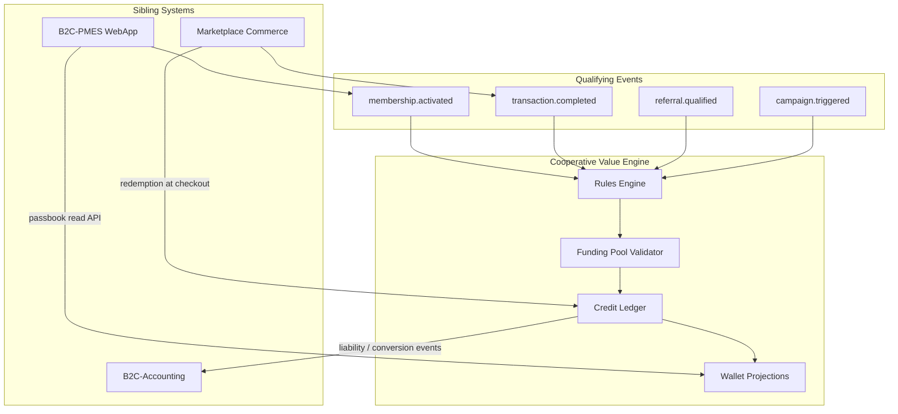
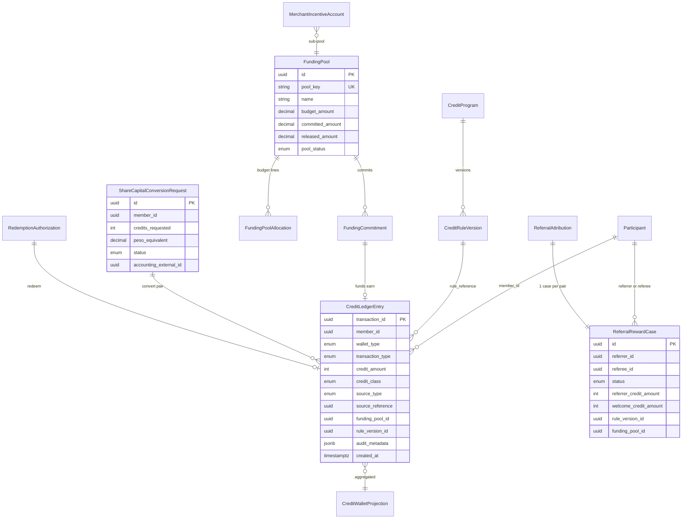
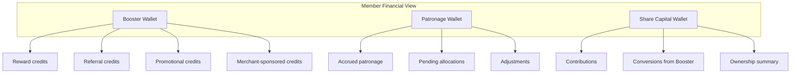
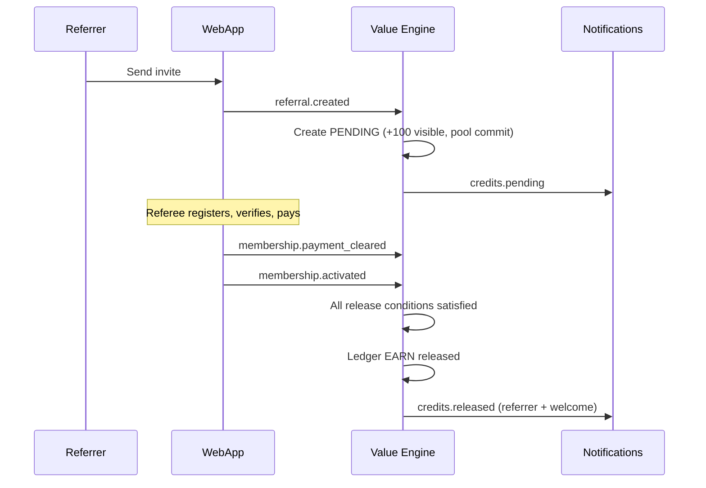

# B2CCoop Cooperative Value Engine

> **Status:** **Approved** architecture — **Platform Phase P4** (future capability).  
> **Scope of this document:** Domain design and **integration points only**.  
> **Out of scope until P4:** implementation tasks, UI screens, database migrations, API endpoints, sprint work, and deployment.  
> **Extends:** [PLATFORM-CORE-SERVICES.md](./PLATFORM-CORE-SERVICES.md) §8 (Cooperative Benefits Engine). Does **not** replace [MARKETPLACE-DOMAIN.md](./MARKETPLACE-DOMAIN.md).  
> **Constraint:** Booster Credits are **not** cash and **not** a simple loyalty points table. Every credit has a funding source, immutable ledger entries, and audit trail.

---

## Platform phase P4 — gating

CVE implementation **must not begin** until these operational layers are live:

| Prerequisite layer | Operational means | Reference |
|--------------------|-------------------|-----------|
| **Marketplace Core** | Browse, search, ORDER checkout, receipt, patronage accrual on sales | [UI-BLUEPRINT.md](./UI-BLUEPRINT.md) Sprints 1–3 |
| **Merchant Operations** | Sell dashboard, fulfillment queue, officer persona, listing lifecycle (minimum) | UI-BLUEPRINT Sprint 4 |
| **Membership Layer** | Member resolve, My Coop / passbook link, activity list, member pricing | UI-BLUEPRINT Sprint 5 |

Until then: **no CVE tables, endpoints, or UI** — only stable **integration contracts** (events, IDs, boundaries) documented below so earlier phases do not block P4.

| Platform phase | CVE status |
|----------------|------------|
| P0–P3 | Not started — patronage via existing `patronage_accruals` + Accounting |
| **P4** | **Cooperative Value Engine** — full ledger, pools, pending/release, referrals |
| P5+ | Extensions (geo, scheduling, campaigns) plug into CVE handlers |

---

## Pending Credits (core concept)

**Pending Credits** are promised Booster Credits that are **visible to the member** but **not spendable** and **not ledger-released** until explicit release conditions are met. This is distinct from **available** balance and is essential for fraud prevention, funding-pool commitment, and Accounting liability timing.

### States

| State | Member can spend? | In `EARN` ledger? | Funding pool |
|-------|-------------------|-------------------|--------------|
| **Pending** | No | No | Optional **commitment** reserved |
| **Released** | Yes (available) | Yes (`EARN` posted) | Commitment → **released** |
| **Cancelled / Expired** | No | No | Commitment **returned** |

### Member-facing pattern (referral example)

```text
Invite Member
+100 Booster Credits Pending

Released after:
  ✓ Membership Activated
  ✓ Payment Cleared
```

- **Pending** is shown immediately when a qualifying action occurs (e.g. invite attributed, referee registered) — policy defines how early visibility starts; **release** always requires the full condition checklist.
- **Not released on:** invitation sent alone, registration started, or profile incomplete.
- **Released only when:** all configured gates pass (default referral: `membership.activated` **and** `membership.payment_cleared`).

### Why pending matters (P4)

| Concern | How pending helps |
|---------|-------------------|
| **Fraud** | Credits do not enter available balance until payment and activation verified |
| **Accounting** | Liability and expense recognition align with **release**, not invite |
| **Funding pools** | Budget **committed** when pending is created; **released** only on `EARN` |
| **Reversals** | Cancelled referrals reverse commitment without `REVERSAL` on spendable credits |
| **Member trust** | Clear checklist explains why credits are not yet usable |

### Release condition model (conceptual)

Each pending credit carries `release_conditions[]` evaluated against platform events:

| Condition key | Typical source |
|---------------|----------------|
| `membership.activated` | B2C-PMES |
| `membership.payment_cleared` | B2C-PMES + Accounting membership fee posted |
| `transaction.completed` | Marketplace |
| `fraud.review_passed` | CVE / HQ (optional hold) |

All required conditions must be `satisfied` before `PENDING` → `RELEASED` and ledger `EARN`.

---

## Document map

| # | Deliverable |
|---|-------------|
| 1 | [Domain Model](#1-domain-model) |
| 2 | [ERD Updates](#2-erd-updates) |
| 3 | [Ledger Design](#3-ledger-design) |
| 4 | [Wallet Architecture](#4-wallet-architecture) |
| 5 | [Rules Engine Architecture](#5-rules-engine-architecture) |
| 6 | [Funding Pool Architecture](#6-funding-pool-architecture) |
| 7 | [Passbook Integration](#7-passbook-integration) |
| 8 | [Event Architecture](#8-event-architecture) |
| 9 | [Governance Controls](#9-governance-controls) |
| 10 | [Reporting Architecture](#10-reporting-architecture) |
| — | [Integration Points (P4)](#integration-points-p4) |

---

## Executive summary

The **Cooperative Value Engine** (CVE) is a first-class **Membership Services** platform capability hosted primarily in the **Marketplace API** (B2C-Store), orchestrating:

- **Booster Credits** — cooperative incentive currency (ledger-derived balances)
- **Referral rewards** — two-sided, activation-gated, funding-pool-backed
- **Member & merchant incentives** — rules-driven earn/redeem programs
- **Patronage integration** — operational mirror + signals; **Accounting remains authoritative** for peso patronage liability
- **Share capital conversion** — governed bridge from Booster Credits to cooperative equity (Accounting posts legal entries)



---

# 1. Domain Model

## 1.1 Bounded context

| Context | Owner | Responsibility |
|---------|-------|----------------|
| **Member identity & lifecycle** | B2C-PMES | `Participant.id`, referral attribution, membership activation |
| **Value ledger & programs** | Marketplace (CVE) | Booster ledger, rules, funding pools, redemption authorization |
| **Financial truth** | B2C-Accounting | Patronage payable (21310), share capital (30130), membership revenue (40420), booster liability GL |
| **Commerce triggers** | Marketplace | Transactions that qualify for earn/redeem rules |

CVE **orchestrates**; it does **not** replace statutory coop accounting.

## 1.2 Core entities

### `Participant` (external — WebApp)

Stable key: `Participant.id` (UUID). All CVE records reference this — never email alone.

### `CreditWallet` (aggregate root — projection)

Logical wallet per member per `wallet_type`. **No balance column is authoritative** — balance = `SUM(ledger entries)` per sub-ledger.

| `wallet_type` | Purpose |
|---------------|---------|
| `BOOSTER` | Reward, referral, promo, merchant-sponsored credits |
| `PATRONAGE` | Operational patronage allocations & adjustments (peso-linked signals) |
| `SHARE_CAPITAL` | Share capital contributions & conversions (links to Accounting) |

### `CreditSubWallet` (Booster only)

Partitions inside Booster Wallet for reporting and redemption policy — not separate ledgers unless policy requires isolation.

| `sub_wallet_kind` | Examples |
|-------------------|----------|
| `REWARD` | General earn rules |
| `REFERRAL` | Referrer / welcome referral credits |
| `PROMOTIONAL` | Campaign budgets |
| `MERCHANT_SPONSORED` | Seller-funded incentives |

Sub-wallet is a **dimension** on ledger entries (`credit_class`), not a second balance table.

### `CreditLedgerEntry` (immutable)

Append-only. See [§3 Ledger Design](#3-ledger-design).

### `FundingPool`

Budget container with allocated, committed, released, and available amounts. Every **EARN** must commit/release against a pool.

### `CreditRule` / `CreditProgram`

Configurable rule definitions (referral default, marketplace earn %, etc.). Versioned; `rule_reference` on each ledger entry points to `rule_version_id`.

### `ReferralAttribution`

Links `referee_participant_id` → `referrer_participant_id`. Owned by PMES; CVE subscribes to lifecycle events.

### `ReferralRewardCase`

State machine for a single referral pair’s reward lifecycle (pending → released).

### `RedemptionAuthorization`

Checkout-time hold on credits before `REDEEM` posts (prevents double spend).

### `ShareCapitalConversionRequest`

Governed workflow: member request → approval → ledger CONVERT → Accounting journal.

### `MerchantIncentiveAccount`

Merchant-scoped funding sub-pool for seller-sponsored booster campaigns.

---

## 1.3 Value objects

| Object | Fields |
|--------|--------|
| `MoneyPHP` | `amount`, `currency: PHP` — patronage & share capital |
| `CreditAmount` | `quantity` (integer Booster Credits), `credit_class` |
| `FundingDraw` | `pool_id`, `amount`, `commitment_id` |
| `SourceReference` | `source_type`, `source_id` (transaction_id, membership_id, referral_case_id) |
| `AuditMetadata` | `ip`, `user_agent`, `correlation_id`, `policy_snapshot` |

## 1.4 Domain invariants

1. **No issuance without funding** — `EARN` rejected if `pool.available < amount`.
2. **Ledger-only balances** — wallet UI reads projections; never writes balance directly.
3. **Credits ≠ cash** — redemption only through declared channels; no withdrawal to bank via booster.
4. **Idempotent issuance** — same `(source_reference, rule_reference, member_id)` cannot double-`EARN`.
5. **Patronage peso** — Accounting wins on conflict; CVE patronage wallet reconciles nightly.
6. **Share capital conversion** — requires `CONVERT` ledger entry **and** Accounting `share_capital.contribution` post with shared `external_id`.

## 1.5 Relationship to MVP today

| Today | CVE evolution |
|-------|----------------|
| `patronage_accruals` (Store) | Becomes patronage **signal** + optional `PATRONAGE` wallet entry; Accounting posting unchanged |
| PMES `referralJoinCreditedAt` + Pioneer Points | Migrates to `ReferralRewardCase` + Booster `EARN` on `membership.activated` |
| `benefit_programs` / `benefit_events` (planned §8) | Absorbed into `CreditProgram` + `CreditLedgerEntry` |

---

# 2. ERD Updates

> **P4 note:** ERD below is **conceptual** for approved architecture. **No database migrations** until Platform Phase P4 prerequisites are met.

CVE tables live in **Marketplace Postgres** (`b2ccoop_store`). PMES and Accounting keep their schemas; integration via IDs and events only.



### New tables (Marketplace DB)

| Table | Purpose |
|-------|---------|
| `credit_programs` | Program registry (`REFERRAL`, `MARKETPLACE_EARN`, `WELCOME`, …) |
| `credit_rule_versions` | Immutable rule config snapshots |
| `funding_pools` | Pool master |
| `funding_pool_allocations` | HQ budget lines (fiscal period, department) |
| `funding_commitments` | Reserve before release; ties to pending rewards |
| `credit_ledger_entries` | **Source of truth** for booster balances |
| `credit_wallet_snapshots` | Optional materialized cache (rebuild from ledger) |
| `referral_reward_cases` | Referral state machine |
| `redemption_authorizations` | Checkout holds |
| `share_capital_conversion_requests` | Conversion workflow |
| `merchant_incentive_accounts` | Merchant pool linkage |
| `credit_expiration_schedules` | Future-dated `EXPIRE` jobs |
| `cve_audit_log` | Admin actions (adjustments, rule changes) |

### PMES (minimal additions)

| Column / table | Purpose |
|----------------|---------|
| `Participant.membershipActivatedAt` | Canonical activation timestamp (if not already derivable) |
| `referral_attributions` | Already via `referredByParticipantId` — keep |
| Deprecate `referralJoinCreditedAt` | After CVE cutover — was boolean trigger for Pioneer Points |

### Accounting (additions)

| Concept | Purpose |
|---------|---------|
| GL account **Booster Credit Liability** (e.g. 21320) | Outstanding booster obligation |
| GL account **Member Incentives Expense** (e.g. 50420) | Expense when credits released |
| `source` types: `booster.released`, `booster.redeemed`, `booster.converted_to_share_capital` | Integration postings |
| Allocation rule: membership fee → Membership Acquisition Budget (operational tag, not GL) | Maps revenue to funding pool |

---

# 3. Ledger Design

## 3.1 Principles

- **Append-only** — no UPDATE/DELETE on `credit_ledger_entries`; corrections use `REVERSAL` + compensating entry.
- **Signed amounts** — `credit_amount` positive for earn, negative for redeem/expire (or separate direction enum — pick one convention and enforce).
- **Double-entry at funding layer** — pool `committed`/`released` mirrors credit issuance (not full coop GL — that's Accounting).

## 3.2 Transaction types

| Type | Effect on member balance | Effect on funding pool |
|------|--------------------------|------------------------|
| `EARN` | +credits | commit → release |
| `REDEEM` | −credits | — (already released) |
| `EXPIRE` | −credits | return unused budget (optional policy) |
| `ADJUST` | ±credits | manual HQ adjustment with approval |
| `CONVERT` | −booster credits | — ; triggers share capital workflow |
| `TRANSFER` | ±credits between sub-wallets | — (internal reclassification) |
| `REVERSAL` | negates prior entry | reverses commitment |
| `REFUND` | restores credits after failed redemption | — |

## 3.3 Entry schema (canonical)

| Field | Type | Required | Notes |
|-------|------|----------|-------|
| `transaction_id` | UUID | ✓ | Unique; client idempotency key |
| `member_id` | UUID | ✓ | `Participant.id` |
| `wallet_type` | ENUM | ✓ | `BOOSTER`, `PATRONAGE`, `SHARE_CAPITAL` |
| `transaction_type` | ENUM | ✓ | See §3.2 |
| `credit_amount` | INT | ✓ | Booster credits (integer); patronage uses linked `money_amount` |
| `money_amount` | DECIMAL | | Patronage / conversion peso |
| `credit_class` | ENUM | | `REWARD`, `REFERRAL`, `PROMOTIONAL`, `MERCHANT_SPONSORED` |
| `source_type` | ENUM | ✓ | `MEMBERSHIP`, `REFERRAL`, `TRANSACTION`, `CAMPAIGN`, `MANUAL`, … |
| `source_reference` | UUID | ✓ | FK to domain object |
| `funding_pool_id` | UUID | ✓ on EARN | Nullable on REDEEM |
| `rule_reference` | UUID | ✓ on EARN | `credit_rule_versions.id` |
| `created_by` | TEXT | ✓ | `system`, `service:store-api`, `staff:{id}` |
| `created_at` | TIMESTAMPTZ | ✓ | Immutable |
| `audit_metadata` | JSONB | ✓ | correlation, IP, policy hash |
| `reverses_transaction_id` | UUID | | For REVERSAL |

## 3.4 Balance projection

```text
available_balance(member, BOOSTER) =
  SUM(credit_amount WHERE wallet_type=BOOSTER AND NOT expired)
  − SUM(active_redemption_holds)

pending_balance(member, BOOSTER) =
  SUM(PENDING credit cases not yet RELEASED)
  -- visible to member; NOT included in available_balance
```

Patronage wallet:

```text
patronage_balance(member) =
  Accounting.patronage_payable_balance(participant_id)  -- authoritative
  OR operational cache refreshed from Accounting API
```

Share capital wallet:

```text
share_capital_balance(member) =
  Accounting.equity_balance(participant_id, account 30130)
```

## 3.5 Posting flows

### Earn (referral released)

1. Validate `ReferralRewardCase.status = APPROVED`.
2. Validate funding pool available ≥ amount.
3. Insert `funding_commitment` → `RELEASED`.
4. Insert `credit_ledger_entries` (`EARN`, `credit_class=REFERRAL`).
5. Emit `credits.released`.
6. Async: Accounting `booster.released` expense + liability (policy-dependent).

### Redeem (checkout discount)

1. Create `redemption_authorization` (hold).
2. On payment success: `REDEEM` entry; release hold.
3. On payment failure: release hold, no ledger redeem.
4. Emit `credits.redeemed`.

### Convert (share capital)

1. Member submits `ShareCapitalConversionRequest`.
2. Officer/Board approval (workflow).
3. `CONVERT` booster entry (−credits).
4. Accounting `share_capital.contribution` with `external_id = conversion_request.id`.
5. Emit `share_capital.conversion_completed`.

---

# 4. Wallet Architecture

## 4.1 Three-wallet model



## 4.2 Booster Wallet

| Attribute | Source |
|-----------|--------|
| Available credits | Ledger projection |
| Pending credits | `ReferralRewardCase` and other cases in `PENDING` (see [Pending Credits](#pending-credits-core-concept)) |
| Lifetime earned | `SUM(EARN)` |
| Lifetime redeemed | `SUM(REDEEM)` |
| By class breakdown | Group by `credit_class` |
| Expiring soon | `credit_expiration_schedules` |

**Redemption policies** may restrict which `credit_class` can pay which basket (e.g. merchant-sponsored only at that merchant).

## 4.3 Patronage Wallet

| Attribute | Source |
|-----------|--------|
| Current balance | Accounting API (21310 member sub-ledger) |
| Recent accruals | `patronage_accruals` / transaction events |
| Pending | Unposted transactions |

CVE **does not calculate statutory patronage refunds** — it displays and links. Future: `PATRONAGE` ledger entries for **allocations** when board declares refunds (Accounting-driven).

## 4.4 Share Capital Wallet

| Attribute | Source |
|-----------|--------|
| Paid-up balance | Accounting 30130 |
| Conversion history | `share_capital_conversion_requests` + ledger |
| Pending conversions | Workflow queue |

## 4.5 Wallet relationships

| From | To | Relationship |
|------|-----|--------------|
| Booster | Share Capital | `CONVERT` at configured rate; one-way |
| Booster | Marketplace | `REDEEM` at checkout |
| Patronage | — | Not convertible to booster (separate cooperative benefit) |
| Merchant pool | Booster | Merchant funds → member `MERCHANT_SPONSORED` earn |

---

# 5. Rules Engine Architecture

## 5.1 Design pattern

**Program + versioned rules + event handlers** — extends PLATFORM-CORE-SERVICES §8 plugin model.


Each `CreditProgram` registers:

- `qualifying_events[]`
- `rule_versions[]` (immutable once published)
- `handler_key`

## 5.2 Rule configuration schema (conceptual)

| Field | Description |
|-------|-------------|
| `program_key` | `REFERRAL_MEMBERSHIP`, `MARKETPLACE_CASHBACK`, … |
| `effective_from` / `effective_to` | Date window |
| `earn_type` | `FIXED`, `PERCENTAGE`, `TIERED`, `CATEGORY_MATRIX`, `CAMPAIGN` |
| `earn_value` | Credits or % definition |
| `funding_pool_key` | Required pool |
| `eligibility` | JSON DSL: member tier, category, seller, min amount |
| `caps` | Per-member, per-period, global |
| `redemption_rules` | Where credits can be spent |
| `expiration_days` | Optional TTL |
| `two_sided` | Referrer + welcome toggles |

## 5.3 Supported rule domains

| Domain | Trigger event | Example |
|--------|---------------|---------|
| Membership signup | `membership.activated` | Welcome 50 credits |
| Referrals | `referral.qualified` | Referrer 100 credits |
| Marketplace purchases | `transaction.completed` | 2% earn |
| Merchant sales | `transaction.completed` | Seller performance bonus |
| Service / tour bookings | `booking.completed` | Fixed 25 credits |
| Insurance / loan referrals | `lead.converted` | Fixed referral |
| Promotional campaigns | `campaign.triggered` | Bonus multiplier |
| Community / training / volunteer | `activity.attended` | Attendance credits |

## 5.4 Initial referral rule (configurable default)

| Side | Default | Enabled flag |
|------|---------|--------------|
| Referrer | 100 Booster Credits | `referrer_reward_enabled` |
| New member welcome | 50 Booster Credits | `welcome_reward_enabled` |

| Property | Value |
|----------|-------|
| Visibility trigger | Referral attributed (e.g. invite accepted / referee linked) — creates **Pending** display |
| Release trigger | **All** release conditions satisfied (default: `membership.activated` **and** `membership.payment_cleared`) |
| Funding pool | `MEMBERSHIP_ACQUISITION` (sourced from membership fee allocation policy) |
| Prerequisite chain | Invite → Registered → Verified → **Paid** → **Activated** |
| Case status flow | `PENDING` → `RELEASED` \| `CANCELLED` \| `EXPIRED` (optional `APPROVED` if manual fraud review) |

**Pending:** member sees “+100 Booster Credits Pending”; pool may **commit**; ledger `EARN` only on **RELEASED**.

## 5.5 Evaluation pipeline

1. Receive event with `participant_id`, payload.
2. Load active `rule_versions` for event type.
3. Evaluate eligibility DSL (tier, fraud checks).
4. Compute credit amount; apply caps.
5. `FundingPoolValidator.reserve(commitment)`.
6. Create `ReferralRewardCase` or immediate `EARN` per program design.
7. Emit `credits.pending` or `credits.released`.

## 5.6 Idempotency

Key: `sha256(program_key + rule_version_id + source_reference + member_id + side)`.

Duplicate events (webhook retry) must not double-earn.

---

# 6. Funding Pool Architecture

## 6.1 Pool types (examples)

| `pool_key` | Typical source | Use |
|------------|------------------|-----|
| `MEMBERSHIP_ACQUISITION` | % allocation of membership fee revenue | Referral, welcome rewards |
| `MARKETPLACE_REVENUE` | % of marketplace commission | Purchase cashback |
| `MERCHANT_SUBSCRIPTION` | Seller subscription fees | Merchant-funded promos |
| `CAMPAIGN_BUDGET` | HQ discretionary budget | Seasonal promos |
| `PARTNER_SPONSORSHIP` | Partner contributions | Coalition rewards |

## 6.2 Pool ledger (operational)

Each pool tracks:

| Field | Meaning |
|-------|---------|
| `budget_amount` | HQ-approved ceiling for period |
| `allocated_amount` | Sum of allocation lines |
| `committed_amount` | Pending rewards reserved |
| `released_amount` | Credits actually issued |
| `available_amount` | `budget − committed − released` (formula fixed per policy) |

## 6.3 Issuance gate

```text
ON EARN request:
  IF available_amount < credit_amount THEN REJECT (budget_exhausted)
  ELSE commit → release → ledger EARN
```

## 6.4 Membership fee allocation (example policy)

Configurable at HQ — not hardcoded:

| Allocation | % of ₱500 fee |
|------------|---------------|
| Operations | 70% |
| Membership Acquisition Budget → `MEMBERSHIP_ACQUISITION` pool | 20% |
| Reserve | 10% |

Accounting still posts full ₱500 to revenue; **pool funding** is a **management accounting** allocation updated periodically from actual revenue (or per-payment micro-allocation).

## 6.5 Merchant-sponsored pools

Merchant tops up `merchant_incentive_accounts` linked to `MERCHANT_SUBSCRIPTION` or dedicated pool. Credits earned carry `credit_class=MERCHANT_SPONSORED` and `source_reference=seller_id`.

---

# 7. Passbook Integration

> **P4 note:** Passbook **Booster** and **pending** sections are **future** (Phase P4). Until then, PMES passbook continues patronage/share capital via Accounting; Store My Coop links to passbook per Sprint 5 — **no Booster UI in prior phases**.

## 7.1 Product placement (integration boundary)

| System | P4 role |
|--------|---------|
| **B2C-PMES** | Primary passbook host; owns membership status display |
| **B2C-Store** | My Coop summary + deep link; does not duplicate full passbook |
| **CVE** | Supplies booster + pending read projections when P4 is live |
| **Accounting** | Authoritative peso balances (patronage, share capital) |

## 7.2 Future passbook data domains (conceptual)

| Domain | Authoritative source (P4) |
|--------|---------------------------|
| Membership status | PMES |
| Booster available | CVE ledger projection |
| **Booster pending** | CVE pending cases + `release_conditions` status |
| Lifetime earned / redeemed | CVE ledger aggregates |
| Share capital | Accounting |
| Patronage | Accounting (+ Store accrual signals) |
| Referral activity | PMES attribution + CVE cases |

## 7.3 Future read model fields (conceptual DTO)

Includes `booster.pending`, `booster.pendingItems[]` with `amount`, `reason`, `releaseConditions[]` (each `key`, `label`, `satisfied`), and `referrals.summary` — **contract only**; not built until P4.

---

# 8. Event Architecture

## 8.1 Transport

Cloudflare Queues + outbox pattern (per PLATFORM-CORE-SERVICES §9). PMES publishes membership events; Store CVE consumes.

## 8.2 Event catalog

| Event | Producer | Consumer | Payload highlights |
|-------|----------|----------|-------------------|
| `referral.created` | PMES | CVE | referrer_id, referee_id |
| `referral.qualified` | PMES | CVE | activation timestamp |
| `membership.payment_cleared` | PMES / Accounting | CVE | participant_id, fee posting ref |
| `membership.activated` | PMES | CVE, Accounting | participant_id, activation timestamp |
| `credits.pending` | CVE | Notifications | amount, reason, case_id |
| `credits.approved` | CVE | Audit | officer_id |
| `credits.released` | CVE | Notifications, Accounting | ledger transaction_id |
| `credits.redeemed` | CVE | Analytics, Accounting | checkout_id |
| `credits.expired` | CVE | Notifications | amount |
| `credits.converted` | CVE | Accounting | conversion_request_id |
| `wallet.adjusted` | CVE | Audit | ADJUST entry |
| `share_capital.conversion_requested` | CVE | Workflow | credits, rate |
| `share_capital.conversion_completed` | CVE | PMES, Accounting | external_id |

Commerce events (`transaction.completed`, `booking.completed`) already defined in platform docs — CVE handlers subscribe without changing transaction schema.

## 8.3 Referral workflow (event sequence)



## 8.4 Failure handling

- DLQ for failed handlers; manual replay with idempotency.
- `credits.pending` stuck → expiry job → `EXPIRED` + pool release.
- Accounting post failure → case stays `RELEASED` in CVE but `accounting_sync_status=PENDING` until retry (CVE ledger is operational truth for credits; finance team reconciles).

---

# 9. Governance Controls

## 9.1 Financial safeguards

| Control | Mechanism |
|---------|-----------|
| Funding pool limits | Hard reject on insufficient `available` |
| Credit liability reporting | Daily sum outstanding → Accounting reconciliation |
| Expiration policies | `credit_expiration_schedules` + batch `EXPIRE` |
| Budget exhaustion | Alert HQ at 80/90/100% pool utilization |
| Duplicate referral detection | One case per `(referrer, referee)` pair |
| Self-referral prevention | Block same `participant_id`, shared device fingerprint (signal), same payment instrument |
| Manual adjustments | `ADJUST` requires `staff_role` + reason code + dual approval optional |
| Fraud monitoring | Velocity limits, anomaly flags, hold `PENDING` for review |

## 9.2 Share capital conversion governance

| Control | Description |
|---------|-------------|
| Conversion rate | Board-approved schedule in `credit_rule_versions` |
| Per-transaction limits | Max credits per conversion |
| Annual limits | Per member per fiscal year |
| Approval workflow | Treasurer + optional Board for amounts > threshold |
| Audit trail | Full chain: request → approvals → ledger → Accounting JV |
| Program windows | Conversion only during approved programs |

## 9.3 Role matrix

| Action | Member | Merchant | Treasurer | HQ | Board |
|--------|--------|----------|-----------|-----|-------|
| View own wallet | ✓ | — | ✓ | ✓ | ✓ |
| Redeem at checkout | ✓ | — | — | — | — |
| Request conversion | ✓ | — | — | — | — |
| Approve conversion | — | — | ✓ | ✓ | ✓ (high amounts) |
| Configure rules | — | — | — | ✓ | ✓ (policy) |
| Adjust credits | — | — | ✓ | ✓ | — |
| Manage funding pools | — | — | ✓ | ✓ | ✓ (budget) |
| Sponsor merchant pool | — | ✓ | — | ✓ | — |

## 9.4 Audit

- Immutable `credit_ledger_entries`.
- `cve_audit_log` for config changes and adjustments.
- Correlation IDs across PMES → CVE → Accounting.
- Periodic **reconciliation report**: CVE outstanding vs Accounting liability account.

---

# 10. Reporting Architecture

## 10.1 Read models

Materialized views (or nightly batch) — never query raw ledger for heavy HQ dashboards.

| View | Purpose |
|------|---------|
| `rpt_credits_issued_daily` | By program, pool, class |
| `rpt_credits_redeemed_daily` | By channel (checkout, fees, booking) |
| `rpt_credits_outstanding` | Liability exposure |
| `rpt_funding_pool_utilization` | Budget vs committed vs released |
| `rpt_referral_performance` | Funnel: invite → activated → released |
| `rpt_share_capital_conversions` | Credits → peso → equity |
| `rpt_member_engagement` | Earn/redeem active members |

## 10.2 Dashboards by persona

### Member (Passbook / My Coop)

- Available / pending booster
- Referral progress
- Patronage & share capital summary
- Recent activity

### Merchant

- Sponsored pool balance
- Credits issued to customers (their campaigns)
- ROI: redemptions at their listings

### HQ

- Pool utilization heatmap
- Program performance
- Fraud holds queue
- Rule version audit

### Finance

- Credit liability exposure (CVE + Accounting)
- Expense recognition (incentives expense)
- Reconciliation exceptions
- Funding source traceability

### Board

- Membership acquisition cost per activated member
- Referral program ROI
- Share capital conversion trends
- Policy compliance (limits, approvals)

## 10.3 Key metrics

| Metric | Formula |
|--------|---------|
| Credits issued | `SUM(EARN)` in period |
| Credits redeemed | `SUM(REDEEM)` in period |
| Outstanding liability | `SUM(EARN) − SUM(REDEEM) − SUM(EXPIRE) − SUM(CONVERT)` |
| Referral conversion rate | activated referees / invites sent |
| Cost per activation | pool released / activations |
| Redemption rate | redeemed / issued (cohort) |

---

# Future Extensions (without redesign)

The wallet + ledger + funding pool + **pending/release** architecture supports:

| Extension | How it plugs in |
|-----------|-----------------|
| Merchant-sponsored rewards | `MERCHANT_SPONSORED` class + merchant pools |
| Partner rewards | `PARTNER_SPONSORSHIP` pool + partner handler |
| Coalition loyalty | Cross-program `source_reference` + federation id |
| Community challenges | Time-boxed `CreditProgram` + campaign events |
| Gamification | Badges as metadata on earn events (not separate points) |
| Member tiers | Eligibility DSL dimension `tier` |
| Elite membership | Separate programs + pools |
| Partner discount networks | Redemption channel plugin |

**No schema redesign required** — new `CreditProgram` handlers + pools + rule versions.

---

# Integration Points (P4)

Cross-system boundaries to **preserve during P0–P3** so P4 does not require rework.

## B2C-PMES (WebApp)

| Integration | Direction | P4 use |
|-------------|-----------|--------|
| `Participant.id` | Stable key everywhere | All CVE ledger rows |
| `referredByParticipantId` | PMES → CVE | Referral attribution |
| `membership.payment_cleared` | PMES → event bus | Pending **release** condition |
| `membership.activated` | PMES → event bus | Pending **release** condition |
| Passbook UI host | CVE read projection → PMES | Pending + available booster |
| Deprecate Pioneer Points | PMES internal | Replaced by CVE pending/release |

**Do now (no CVE):** Keep referral attribution accurate; emit lifecycle timestamps Accounting already uses for fee posts.

## B2C-Store (Marketplace)

| Integration | Direction | P4 use |
|-------------|-----------|--------|
| `transaction.completed` | Store → event bus | Marketplace earn rules |
| Checkout | CVE → Pricing | Redeem booster (P4) |
| `patronage_accruals` | Store (existing) | Unchanged until P4; patronage peso stays Accounting-led |
| Member resolve | Store ↔ PMES | `Participant.id` on authenticated checkout |

**Do now:** Idempotent transaction events; patronage on ORDER — no booster fields on cart.

## B2C-Accounting

| Integration | Direction | P4 use |
|-------------|-----------|--------|
| `membership.annual_fee` posted | Accounting ← PMES | `payment_cleared` signal |
| `share_capital.contribution` | Accounting ← CVE (P4) | Conversion completion |
| Booster liability GL (future) | Accounting ← CVE events | On `credits.released` / `redeemed` |
| Patronage 21310 | Accounting (authoritative) | Patronage wallet display |

**Do now:** Clean `participantId` on all membership fee journals for future reconciliation.

## Event bus (skeleton in P1)

| Contract | Purpose |
|----------|---------|
| `referral.created` | Start pending case |
| `membership.payment_cleared` | Satisfy release condition |
| `membership.activated` | Satisfy release condition |
| `credits.pending` | Notify member of pending balance |
| `credits.released` | Notify + Accounting sync |

Handlers are **no-op stubs** until P4; event names and payloads should not change after P1 skeleton.

## Identity

Firebase → `Participant.id` via existing member resolve — **required** before P4 referral and wallet binding.

---

## Related documents

- [MARKETPLACE-DOMAIN.md](./MARKETPLACE-DOMAIN.md)
- [PLATFORM-CORE-SERVICES.md](./PLATFORM-CORE-SERVICES.md) §8
- [UX-ARCHITECTURE.md](./UX-ARCHITECTURE.md) — My Coop, passbook
- [INTEGRATION.md](./INTEGRATION.md)
- B2C-Accounting `ACCOUNTING-INTEGRATION.md` — share capital & membership posting
